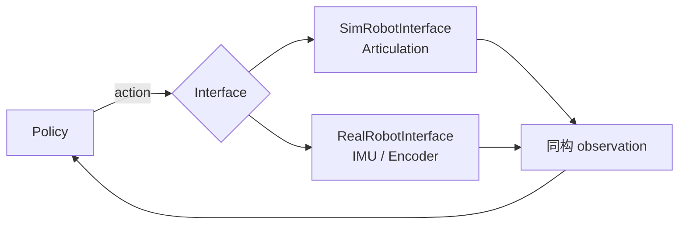

# M6-Sim2Real部署

> 本页属于：stackforce 机器狗实战
> 前置知识：[[M5-鲁棒性]]
> 预计阅读时间：20 分钟

## 🎯 为什么需要这个？

最终把策略部署到实机，且安全地实现 balance → locomotion。M6 目标：**统一接口 + 安全实机测试**。

## 统一架构：Policy 不关心下面是仿真还是真机

```text
                    Policy
                       │
                 observation
                       ▲
             ┌─────────┴─────────┐
             │                   │
        Isaac Sim           Real StackForce
             │                   │
     SimRobotInterface    RealRobotInterface
             │                   │
        Articulation        IMU / Encoder
             │                   │
             └─────────┬─────────┘
                       │
                SAME observation
                SAME action
```

训练时 `action = policy(obs)`，实机也是 `action = policy(obs)`。Policy 不知道下面是 PhysX 还是真机器人。

## 🖼️ 统一接口架构



## 实机测试顺序（第一次上机）

```text
Policy OFF
 ↓
验证 sensor
 ↓
验证 observation 数值范围
 ↓
Policy inference，但不发送 action
 ↓
记录 action
 ↓
检查方向
 ↓
悬空测试
 ↓
10% action limit
 ↓
20%
 ↓
保护架/软垫
 ↓
standing
 ↓
balance
 ↓
velocity command
```

## 硬件层保护（独立设置，RL 不能绕过）

```text
joint position limit
joint velocity limit
motor current limit
body tilt limit
communication timeout
policy timeout
emergency stop
```

## ✏️ 小练习

**1.** 为什么 Policy 要"不知道下面是仿真还是真机"？

<details>
<summary>查看答案</summary>

因为训练和部署用同一套 observation/action，策略才不需要任何改动就能迁移，这是 Sim2Real 的前提。
</details>

**2.** 第一次上机为什么要从 10% action limit 开始？

<details>
<summary>查看答案</summary>

逐步放限幅可安全暴露方向/量程错误，避免一上来全幅动作损坏机器人。
</details>

## 本章小结

- SimRobotInterface / RealRobotInterface 提供同一 observation/action。
- 实机测试按 Policy OFF → 悬空 → 限幅 → 保护架 → standing → balance → velocity 顺序。
- 硬件层限位/超时/急停独立于 RL，策略不能绕过。

## 下一步

- 上一页：[[M5-鲁棒性]]
- 下一页：返回 [[Home]]（stackforce 分级结束）
- 返回：[[Home]]

## 更新日志

- 2026-09-02：新增本页。来源：用户 Roadmap（Phase 11–12）。
