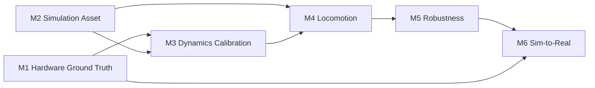

# StackForce 工程 Roadmap

## Project Goal

让 StackForce 四轮足机器人从可验证的实机基线出发，经过仿真资产、动力学校准、运动、鲁棒性和分级部署，最终安全完成真实目标运动任务。

## Current Status

| Milestone | Goal | Gates | PASS | Status |
|---|---|---:|---:|---|
| [[M1-Hardware-Ground-Truth]] | 描述真实机器人 | 10 | 0 | IN PROGRESS |
| [[M2-Simulation-Asset]] | 建立可运行数字机器人 | 8 | 8 | PASS |
| [[M3-Dynamics-Calibration]] | 对齐 Sim/Real 响应 | 6 | 0 | TODO |
| [[M4-Locomotion]] | 完成仿真运动任务 | 6 | 0 | IN PROGRESS |
| [[M5-Robustness]] | 抵抗合理误差和扰动 | 6 | 0 | TODO |
| [[M6-Sim-to-Real]] | 完成安全实机运动 | 8 | 0 | TODO |

Progress: 8 / 44 Gates PASS

## Dependency

M1 与 M2 可以并行，但必须在 M3 汇合。M4 已有 `sf_quad` Direct 代码，因此状态为 IN PROGRESS；在 M2/M3 baseline 冻结前产生的训练结果只能作为开发证据，不能作为最终 locomotion PASS 证据。

## Current Work

- M1：把源码级 hardware audit 推进为实机测量 Ground Truth。
- M2：8/8 Gates PASS，官方 reduced serial training model 已冻结为当前 simulation baseline。
- M4：修正 Direct 环境并建立当前项目自己的 smoke test 与评测证据。

## Current Blockers

- 关节语义、零位、方向、限位、IMU frame、控制频率和延迟仍缺实机结果。
- M1 目标 firmware 尚未冻结，G10 已发现 timeout/failsafe 与 last-command persistence P0 缺口。
- M2 PASS 不替代 M1 实测或 M3 动力学校准，reduced serial model 与真实 five-bar topology 仍需 Sim2Real adapter。

## Evidence Boundary

- `sf_quad/`：当前实现的代码真源。
- Wiki：工程结论、Evidence、进度和决策的知识真源。
- `doc/StackForceDog/`：阶段调查和历史测量资料。
- `Stackforce-simready-111-isaac-lab/`：read-only reference，不是实机 Ground Truth。

## Status Rules

- `TODO`：尚未开始或只有意图。
- `IN PROGRESS`：已有工作，但 Acceptance Criteria 未全部满足。
- `BLOCKED`：已知前置证据或资源缺失，当前不能验收。
- `PASS`：全部 Acceptance Criteria 满足并有 Evidence。

Milestone 只有在所属 Gate 全部 PASS 后才能 PASS。

## Next

先冻结 [[M1-G01-硬件清点]] 的 firmware baseline 并关闭 [[M1-G10-停机验证]] 的 P0 风险，再按低风险顺序完成 M1 实机注册与测量；M2 baseline 可并行供 M3/M4 使用。

### M3/M4 可立即使用的 M2 输入

- reduced serial topology、名义 geometry 与 coordinate contract；
- 数学合法的 inertial baseline 和可运行 collision/joint configuration；
- Direct 与 Manager-Based 的 12-action / 48-observation runtime contract。

这些输入允许继续仿真开发，但 M3 的 actuator/contact identification 和 M6 的 action adapter 仍必须等待 M1 实机证据。

## 更新日志

- 2026-09-08：补充 M1/M2 Evidence Snapshot，并明确 M3/M4 可消费的 M2 输入。
- 2026-09-08：同步 M1/M2 outcome；M2 以 8/8 PASS 收口，总进度更新为 8/44。
