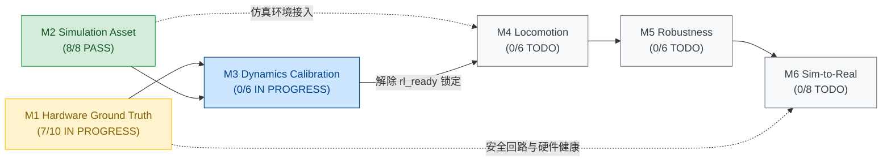

# StackForce 工程 Roadmap 与里程碑

> 本页面属于：StackForce 机器狗实战（总览与视图）  
> 角色定位：**Summary / View Only**。宏观状态由各 Milestone 与 Gate 驱动，本页不维护第二套 Acceptance Criteria，亦不直接作为事实证据真源。

---

## 1. 宏观工程路线总览（Macro Roadmap M1–M6）

StackForce 项目坚持以六阶段宏观路线为唯一顶级推进体系：

| Milestone | 目标与范围 | 门禁总数 | 已关闭 | 当前状态 | 前置依赖 | 当前核心焦点 / 下一步行动 |
|---|---|---:|---:|---|---|---|
| [[M1-Hardware-Ground-Truth]] | 建立真实机器人物理基线与硬件拓扑 | 10 | 7 | **IN PROGRESS** | 无 | 执行 Channel 7 检修后回归测试复测；量化标定 8 舵机物理零位偏置 |
| [[M2-Simulation-Asset]] | 建立闭链数字资产与物理稳定性验证 | 8 | 8 | **PASS** | CAD/STL 图纸 | 保持资产完全冻结，输出单父树 URDF/USD 资产供动力学校验 |
| [[M3-Dynamics-Calibration]] | 对齐 Real↔Sim 响应与执行器动力学 | 6 | 0 | **IN PROGRESS** | M1, M2 | 冻结阶跃/正弦实验协议（G01）；连接真机采集高频遥测数据集 |
| [[M4-Locomotion]] | 完成仿真轮足运动与自稳步态策略 | 6 | 0 | **TODO** | M2, M3 | 等待 M3 动力学参数对齐并解除 `rl_ready = false` 边界锁定 |
| [[M5-Robustness]] | 域随机化与复杂地形抗扰泛化 | 6 | 0 | **TODO** | M4 | 待 M4 基础策略就绪后开展质量、摩擦与时延扰动训练 |
| [[M6-Sim-to-Real]] | 实机影子推理、悬空驱动与实机运动 | 8 | 0 | **TODO** | M1, M5 | 待 M1 硬件安全解封与 M5 策略导出后执行真机部署与终验 |

**宏观进度**：15 / 44 Gates PASS（M1: 7/10, M2: 8/8, M3: 0/6, M4: 0/6, M5: 0/6, M6: 0/8）。  
**当前推进阶段（Current Next Milestone）**：[[M3-Dynamics-Calibration]]（动力学系统辨识与响应对齐）。

---

## 2. 里程碑拓扑依赖图（Milestone Dependency Graph）

---

## 3. 驱动与构件统一命名规范（Canonical Actuation Summary）

全机运动学与动力学构件严格遵守 **Frozen Canonical Component Naming** 合同：

- **12 Actuated Tree Joints（主动驱动树关节）**：
  - 4 $\times$ `{LEG}_Outer_Hip_Joint`（由 `{LEG}_Outer_Servo` 驱动）
  - 4 $\times$ `{LEG}_Inner_Hip_Joint`（由 `{LEG}_Inner_Servo` 驱动）
  - 4 $\times$ `{LEG}_Wheel_Joint`（由 `{LEG}_Wheel_Motor` 驱动）
- **8 Passive Tree Joints（从动被动铰接）**：
  - 4 $\times$ `{LEG}_Outer_Knee_Joint`（被动转动副）
  - 4 $\times$ `{LEG}_Inner_Knee_Joint`（被动转动副）
- **4 Closure Joints（闭环约束副）**：
  - 4 $\times$ `{LEG}_Closure_Joint`（W2 处由 PhysX `PhysicsRevoluteJoint` 恢复，配置 `excludeFromArticulation = true`）

> [!NOTE]
> 详细构件拓扑表参见 [[T-ACT-001-Canonical-Real-Sim-Component-Identity]]；机器可读执行器注册表见 `_meta/canonical_actuator_map.yaml`。

---

## 4. 更新日志

- 2026-09-15：重构为纯 Summary / View 视图；同步最新 Gate 审计结果，重算宏观进度为 15/44；修正 M1/M3 为 IN PROGRESS；全面应用 Canonical Component Naming。
