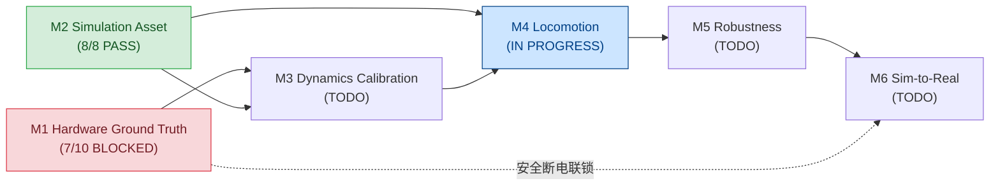
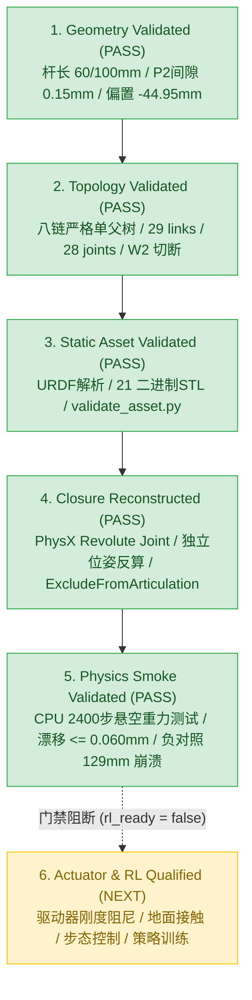

# StackForce 工程 Roadmap 与里程碑

> 知识真源：StackForce 机器狗闭链仿真与实机推进  
> 状态：EVIDENCE GROUNDED（基于项目资产与可执行验证证据）  
> 证据规范：**A PATH IS NOT EVIDENCE.** 证据块由 [[evidence-registry]] 统一定义，绝对路径仅作为本地可选定位符。

---

## 宏观工程路线（Project Macro Roadmap M1–M6）

StackForce 项目坚持以六阶段宏观路线为唯一顶级推进体系，不扩展 M7–M10，不重编号顶级阶段：

| Milestone | 目标 | 门禁数 | 已关闭 | 状态 | 核心产物与阻断点 |
|---|---|---:|---:|---|---|
| [[M1-Hardware-Ground-Truth]] | 描述真实机器人物理基线 | 10 | 7 | **BLOCKED** | 架空 session 已冻结 timing/latency；ch7 回中失败，执行器母线断电中 (`E-HW-001`) |
| [[M2-Simulation-Asset]] | 建立闭链数字资产与物理验证 | 8 | 8 | **PASS** | 严格单父树 URDF、PhysX 闭环恢复与 2400 步重力仿真烟囱测试通过 (`E-ASSET-001`~`E-PHYS-002`) |
| [[M3-Dynamics-Calibration]] | 对齐 Sim/Real 响应与执行器动力学 | 6 | 0 | **TODO** | 待电机特性、刚度阻尼与接触摩擦标定 |
| [[M4-Locomotion]] | 完成仿真轮足运动与步态任务 | 6 | 0 | **IN PROGRESS** | 基础 Gym 环境接入探索中 |
| [[M5-Robustness]] | 域随机化与抵抗真实世界扰动 | 6 | 0 | **TODO** | 待 M4 策略基线 |
| [[M6-Sim-to-Real]] | 完成安全实机运动与部署 | 8 | 0 | **TODO** | 强依赖 M1 解除安全阻断与 M3 动力学对齐 |

**宏观进度**：15 / 44 Gates closed。

---

## 机器人自由度与驱动拓扑划分（Robotic Actuation Partition）

根据机械五杆机构原理与仿真引擎规范，整机自由度严谨划分为以下层次，**严禁笼统表述为“20 自由度”或“20 active DOF”**：

- **树状转动关节（Tree Revolute Joints）**：共 **20 个**。每腿 5 个（M1, P1, W1, M2, P2），4 腿 $\times$ 5 = 20。
- **主动控制输入自由度（Active Actuated DOFs）**：共 **12 个**。
  - 4 $\times$ M1（外大腿主动舵机）；
  - 4 $\times$ M2（内大腿主动舵机）；
  - 4 $\times$ W1（轮毂电机驱动转轴）。
- **被动机械铰接（Passive Revolute Joints）**：共 **8 个**。
  - 4 $\times$ P1（外膝部被动转动铰）；
  - 4 $\times$ P2（内膝部被动转动铰）。
- **闭环运动学约束副（Closure Constraints）**：共 **4 个**。
  - 4 $\times$ W2（内外支链轮轴闭环副，由 PhysX `PhysicsRevoluteJoint` 实现，配置 `excludeFromArticulation=true`）。

> [!IMPORTANT]
> **机构语义划分 vs 仿真执行器配置边界**：
> 机械语义上 P1/P2 为纯被动转动副（Passive）。但在当前 URDF 导入生成的 USD 中，Isaac Sim URDF Importer 为所有 20 个树状转动关节自动赋予了默认的 `PhysicsDriveAPI:angular`（stiffness=0, damping=0）。
> 目前尚未完成驱动器真实刚度、阻尼与动力学特性的标定，资产处于 **`rl_ready = false`** 状态（见 `E-RL-001`）。

---

## 闭链仿真资产研发演进（Ref B / Closed-Link Asset Sub-Progression）

作为 [[M2-Simulation-Asset]] 内部的资产研发子阶段，工程团队完成了从几何识别到物理验证的 8 级扎实递进：

| 子阶段 | 阶段目标 | 核心工程证据 | 状态 | 判定与观测真值 |
|---|---|---|---|---|
| **Sub-1: 机械几何识别** | 识别真实双支链五杆机构与杆长基准 | `E-MECH-001` `four_inner_chains_validation.json` | **PASS** | 确定 60 mm 大腿、100 mm 小腿、40 mm 投影间距，排除了假单串联假设 |
| **Sub-2: FR 主内链注册** | 完成右前腿经典几何定位与装配对齐 | `ref_b_real_fr.usdc` `E-ASSET-002` | **PASS** | P2 配合间隙 0.150 mm，W1/W2 轴向偏置 -44.950 mm，径向残差 1.83e-14 mm |
| **Sub-3: 四腿内链构建** | 底盘对称反射与单平面绕向反转 | `four_inner_chains_validation.json` `E-MECH-001` | **PASS** | 4 腿对称误差 $\le 6.14 \times 10^{-6}\text{ mm}$，四腿几何与偏置全绿通过 |
| **Sub-4: 八链 Loop-Cut URDF** | 生成严格树状 URDF（4 外链 + 4 内链） | `stackforce_quadrupedal_wheeled_robot.urdf` `E-ASSET-001` | **PASS** | 29 links、28 joints、唯一根 `base_link`，每 link 严格单父级，W2 显式切断 |
| **Sub-5: 闭环元数据持久化** | 持久化 W1/W2 闭环轴向/径向关系与位姿 | `closure_frames.json` `E-ASSET-002` | **PASS** | 记录 4 腿共同机械轴向、三维基座坐标、-44.950 mm 轴向偏置与 1.83e-17 m 残差 |
| **Sub-6: USD 导入与闭环恢复** | 导入 USD 并重建 PhysX 转动闭环副 | `recover_closed_loops.py` `E-ASSET-003` | **PASS** | 独立反算 `localPos0/1` 与 `localRot0/1`，创建 4 个排除在关节树外的 PhysX 闭环副 |
| **Sub-7: 静态资产自动化校验** | 自动化校验树拓扑、连通性、mesh 与残差 | `validate_asset.py` `E-ASSET-004` | **PASS** | 机器校验通过：29 links, 28 joints, 21 binary STL meshes, 4 closure pairs |
| **Sub-8: 悬空重力物理烟囱测试** | CPU 悬空 2400 步重力仿真与负对照 | `simulation_report.json` `E-PHYS-001`, `E-PHYS-002` | **PASS** | 2400 步（10 s @ 240 Hz）运动 0.0906 m，最大漂移 0.0595 mm；负对照漂移 129 mm 崩溃 |

---

## 验收分级与当前边界（Validation Boundary）

项目在工程质量上严格区分以下五个等级，禁止越级宣称：

1. **Geometry Validated（PASS）**：杆长 60 mm / 100 mm，W1/W2 轴向偏置 $-44.950\text{ mm}$，径向残差 $< 1.83 \times 10^{-17}\text{ m}$，P2 间隙 $0.150\text{ mm}$（`E-MECH-001`, `E-ASSET-002`）。
2. **Topology Validated（PASS）**：URDF 保持严格数学树结构，29 links / 28 joints，唯一根 `base_link`，不存在环状死锁（`E-ASSET-001`）。
3. **Static Asset Validated（PASS）**：`validate_asset.py` 自动化检查 link 存在性、mesh 二进制头合法性、闭环配置完备性，测试代码返回值 0（`E-ASSET-004`）。
4. **Closure Reconstructed（PASS）**：`recover_closed_loops.py` 在 USD 中从公共坐标系独立反算位姿，生成 4 个 `PhysicsRevoluteJoint` 并配置 `excludeFromArticulation=true`（`E-ASSET-003`）。
5. **Physics Smoke Validated（PASS）**：`simulation_validation.py` 在 CPU 悬空重力场下运行 2400 步（10 秒），实测刚体运动位移 $0.0906\text{ m}$，四腿最大闭环锚点漂移 $0.0595\text{ mm}$（$\le 0.060\text{ mm}$，远优于 $1\text{ mm}$ 门禁），最大轴向角误差 $5.23 \times 10^{-6}\text{ rad}$；负对照禁用闭环副导致漂移急剧增加至 $129\text{ mm}$ 并在第 480 步抛错崩溃，确凿证明物理约束生效（`E-PHYS-001`, `E-PHYS-002`）。
6. **Actuator & RL Qualified（NEXT / NOT READY）**：
   - ⚠️ **`rl_ready = false`**：当前资产仅完成悬空重力烟囱测试；
   - 驱动器真实阻尼、刚度、电机关联特性尚未完成动力学标定（[[M3-Dynamics-Calibration]] 职责）；
   - 地面接触模型与强化学习训练任务（[[M4-Locomotion]]）尚未验收；
   - **严禁声称当前资产可直接用于强化学习策略训练**。

---

## 产物角色与定位速查（Artifact Map）

| 规范相对路径（以 `$PROJECT_ROOT` 为基准） | 工程角色与职责 | 验证手段与证据 ID |
|---|---|---|
| `sf_quad/.../urdf/stackforce_quadrupedal_wheeled_robot.urdf` | **规范树状 URDF**：8 支链严格单父树，W2 显式断开 | `validate_asset.py` (`E-ASSET-001`) |
| `sf_quad/.../config/closure_frames.json` | **闭环元数据**：四腿 W1/W2 轴向偏置与共线残差持久化 | `validate_asset.py` (`E-ASSET-002`) |
| `sf_quad/.../scripts/validate_asset.py` | **静态资产校验器**：断言树拓扑、mesh 格式与闭环配置 | `python3 scripts/validate_asset.py` (`E-ASSET-004`) |
| `sf_quad/.../scripts/recover_closed_loops.py` | **PhysX 闭环重构器**：注入 4 个 `excludeFromArticulation=true` 约束 | Isaac Sim Python (`E-ASSET-003`) |
| `sf_quad/.../usd/stackforce_quadrupedal_wheeled_robot_closed.usda` | **闭链仿真 USD**：包含闭环物理约束副的 Compose Stage | Isaac Sim GUI / 物理仿真 (`E-ASSET-003`) |
| `sf_quad/.../scripts/simulation_validation.py` | **物理烟囱测试器**：执行 2400 步悬空重力测试与负对照 | `E-PHYS-001`, `E-PHYS-002` |
| `sf_quad/.../validation/simulation_report.json` | **物理测试报告**：记录 2400 步实测运动与 0.0595 mm 漂移 | 机器可读 JSON (`E-PHYS-001`) |
| `sf_quad/.../validation/negative_control_report.json` | **负对照报告**：记录禁用闭环副导致 129 mm 漂移崩溃 | 机器可读 JSON (`E-PHYS-002`) |

---

## 严防历史重犯的设计不变量（Design Invariants）

1. **$W_1 \ne W_2$**：严禁强制将 $W_2$ 坐标设为 $W_1$。真实机构存在 $-44.950\text{ mm}$ 轴向层叠厚度，强制重合会导致严重穿模与运动学失真。
2. **严禁在 URDF 中制造多父级回路**：URDF 语法层必须保持严格单父树结构，闭环恢复必须在 Isaac Sim / PhysX 物理约束层完成。
3. **闭环位姿必须从世界系独立反求**：两端构件本体系朝向截然不同，严禁简单拷贝局部位姿。
4. **闭环副必须配置 `excludeFromArticulation=true`**：防止破坏基于 Featherstone 树形算法的关节动力学求解器。
5. **严禁越级宣称 RL-Ready**：在驱动器参数标定与地面接触验证前，保持 `rl_ready = false`。

---

## 更新日志

- 2026-09-14：全面重构 Roadmap 为标准 M1–M6 顶级架构；将闭链研发收敛为 M2 内部子阶段；更新自由度与驱动划分为 20 树关节 / 12 主动 / 8 被动 / 4 约束；收录 2400 步 CPU 重力下沉（0.060 mm）与负对照（129 mm）实验证据；全面采用便携式路径与 [[evidence-registry]] 架构。
- 2026-09-11：同步 M1 两次架空实机 session；更新宏观进度为 15/44，并记录 ch7 powered-actuation blocker。
- 2026-09-08：补充 M1/M2 Evidence Snapshot，并明确 M3/M4 可消费的 M2 输入。
