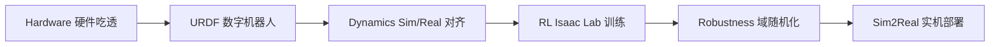

# Roadmap与里程碑

> 本页属于：stackforce 机器狗实战
> 前置知识：[[自定义机器人资产导入]]、[[真机部署]]
> 预计阅读时间：10 分钟

## 🎯 为什么需要这个？

把 StackForce 四轮足桌面机器狗从"官方资料"做到"实机稳定运动"，是一条很长的链。如果第一天就写 RL、训一个"万能机器狗"，大概率会卡在某个方向/频率/动力学不匹配上。所以先立路线图，**按里程碑走，每步都有验收标准**。

## 💡 一个类比

这像造车六步：**先摸清零件（Hardware）→ 造数字模型（URDF）→ 校准台架（Dynamics）→ 学驾驶（RL）→ 抗干扰（Robustness）→ 上路（Sim2Real）**。顺序不能乱。

## 🐍 6 个里程碑

| Milestone | 目标 | 验收标准 |
|-----------|------|----------|
| **M1 Hardware** | 吃透 StackForce | 能独立读传感器、控制全部 actuator |
| **M2 URDF** | 数字机器人 | Isaac Sim 中所有 joint / mesh 正确 |
| **M3 Dynamics** | Sim/Real 对齐 | step response 基本吻合 |
| **M4 RL** | Isaac Lab | 仿真稳定 balance + velocity tracking |
| **M5 Robustness** | DR + latency/noise | 参数随机后仍稳定 |
| **M6 Sim2Real** | 实机部署 | 安全实现 balance → locomotion |

## 🖼️ 总路线图

图 1 六里程碑主链（自绘 Mermaid，本地预览渲染；访问于 2026-09-02）

## Phase → Milestone 映射

| Phase | 内容 | 归入 |
|-------|------|------|
| Phase 0–1 | 吃透官方资料 + 实机原厂控制 | M1 |
| Phase 2–5 | URDF 运动学/动力学 + Isaac Lab Asset | M2 |
| Phase 6 | Sim↔Real 对齐（step response） | M3 |
| Phase 7–9 | Stand/Balance + Action + Curriculum | M4 |
| Phase 10 | Domain Randomization | M5 |
| Phase 11–12 | 统一接口 + 实机测试顺序 | M6 |

## ✏️ 小练习

**1.** 为什么"第一天上 RL"是错的？

查看答案

因为 joint 方向、零位、频率、动力学都没标定，RL 训练出来的策略一上实机就是灾难；必须先 Hardware→URDF→Dynamics 对齐，再谈 RL。

## 本章小结

- 六个里程碑顺序：Hardware → URDF → Dynamics → RL → Robustness → Sim2Real。
- 每个里程碑有明确验收标准。
- 本分级 7 页：本页 + M1–M6。

## 下一步

- 上一页：[[自定义机器人资产导入]]
- 下一页：[[M1-硬件吃透]]
- 返回：[[Home]]

## 更新日志

- 2026-09-02：新增本页。来源：用户 Roadmap（StackForce 四轮足机器狗 RL 实战路线）。
