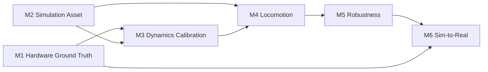

# StackForce 工程 Roadmap

## Project Goal

让 StackForce 四轮足机器人从可验证的实机基线出发，经过仿真资产、动力学校准、运动、鲁棒性和分级部署，最终安全完成真实目标运动任务。

## Current Status

| Milestone | Goal | Gates | Closed | Status |
|---|---|---:|---:|---|
| [[M1-Hardware-Ground-Truth]] | 描述真实机器人 | 10 | 7 | BLOCKED |
| [[M2-Simulation-Asset]] | 建立可运行数字机器人 | 8 | 8 | PASS |
| [[M3-Dynamics-Calibration]] | 对齐 Sim/Real 响应 | 6 | 0 | TODO |
| [[M4-Locomotion]] | 完成仿真运动任务 | 6 | 0 | IN PROGRESS |
| [[M5-Robustness]] | 抵抗合理误差和扰动 | 6 | 0 | TODO |
| [[M6-Sim-to-Real]] | 完成安全实机运动 | 8 | 0 | TODO |

Progress: 15 / 44 Gates closed

## Dependency

M1 与 M2 可以并行，但必须在 M3 汇合。M4 已有 `sf_quad` Direct 代码，因此状态为 IN PROGRESS；在 M2/M3 baseline 冻结前产生的训练结果只能作为开发证据，不能作为最终 locomotion PASS 证据。

## Current Work

- M1：已形成可审计实机 contract；离线 Reference-B/interface 可继续，powered actuation 被 ch7 failure 阻塞。
- M2：8/8 Gates PASS，官方 reduced serial training model 已冻结为当前 simulation baseline。
- M4：修正 Direct 环境并建立当前项目自己的 smoke test 与评测证据。

## Current Blockers

- ch7 在 firmware return/STOP 后仍持续上抬，ch8 可能被动耦合；修复验证前 actuator rail 必须断电。
- final real-action adapter 仍缺部分 servo/wheel polarity 与 rear feedback sign。
- M2 PASS 不替代 M1 实测或 M3 动力学校准，reduced serial model 与真实 five-bar topology 仍需 Sim2Real adapter。

## Evidence Boundary

- `sf_quad/`：当前实现的代码真源。
- Wiki：工程结论、Evidence、进度和决策的知识真源。
- `doc/StackForceDog/`：阶段调查和历史测量资料。
- `Stackforce-simready-111-isaac-lab/`：read-only reference，不是实机 Ground Truth。

## Status Rules

- `TODO`：尚未开始或只有意图。
- `IN PROGRESS`：已有工作，但 Acceptance Criteria 未全部满足。
- `BLOCKED`：已知前置证据或资源缺失，当前不能验收。
- `PASS`：全部 Acceptance Criteria 满足并有 Evidence。

Milestone 只有在所属 Gate 全部 PASS 后才能 PASS。

## Next

先隔离、维修 ch7/ch8，并完成 unloaded/installed tiny return test；安全恢复后补齐 polarity/identity。离线 RL interface 与首版 kinematic Reference-B 可继续，真机 RL/locomotion 不可验收。

### M3/M4 可立即使用的 M2 输入

- reduced serial topology、名义 geometry 与 coordinate contract；
- 数学合法的 inertial baseline 和可运行 collision/joint configuration；
- Direct 与 Manager-Based 的 12-action / 48-observation runtime contract。

这些输入允许继续仿真开发，但 M3 的 actuator/contact identification 和 M6 的 action adapter 仍必须等待 M1 实机证据。

## 更新日志

- 2026-09-11：同步 M1 实机 session；总进度更新为 15/44，M1 因 ch7 hardware/mechanical failure 保持 BLOCKED。
- 2026-09-08：补充 M1/M2 Evidence Snapshot，并明确 M3/M4 可消费的 M2 输入。
- 2026-09-08：同步 M1/M2 outcome；M2 以 8/8 PASS 收口，总进度更新为 8/44。
