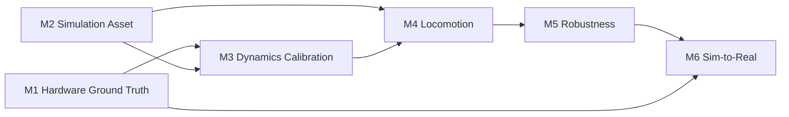
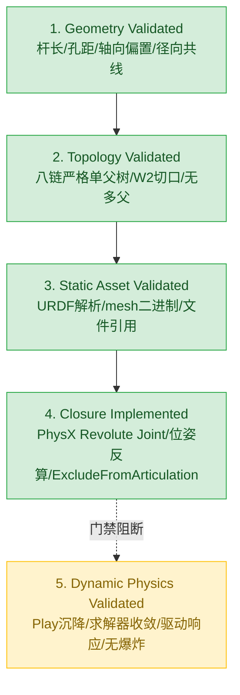
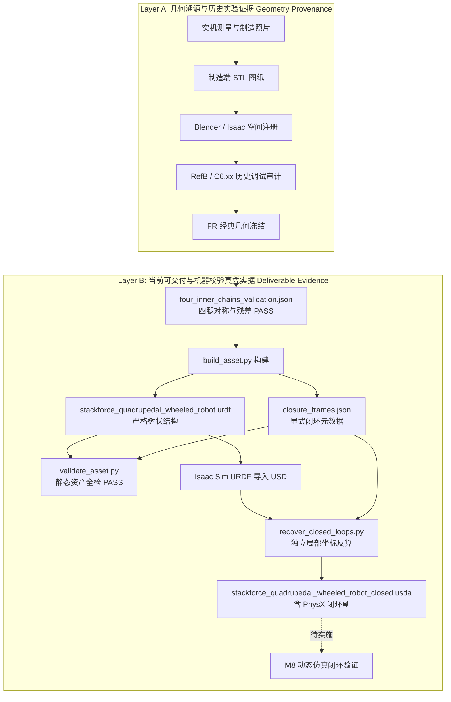

# StackForce 工程 Roadmap 与里程碑

> 知识真源：StackForce 机器狗闭链仿真与实机推进  
> 状态：EVIDENCE GROUNDED（基于项目目录真实资产与可执行验证脚本）

---

## 快速概览（Current Status）

- **Current Stage**: **闭链机器人数字资产已完成静态拓扑闭环与资产校验（Static Asset Validated），进入动态物理仿真验证阶段（Dynamic Closed-Loop Validation）**
- **Completed**:
  1. FR 腿经典内链（canonical inner chain）几何与装配验证（PASS）
  2. 四腿对称扩展（FL, RL, RR 镜像与绕向反转）及机器可读验证通过（PASS）
  3. 八链（4 outer + 4 inner）严格单父级树状（strict tree topology）loop-cut URDF 构建完成（PASS）
  4. W1/W2 闭环坐标系、机械轴与物理偏置元数据（`closure_frames.json`）显式留存（PASS）
  5. Isaac Sim URDF 导入与 PhysX 闭环转动副自动恢复脚本（`recover_closed_loops.py`）实现并已生成闭链 USD（PASS）
  6. 静态资产几何/拓扑不变量校验器（`validate_asset.py`）全绿通过（PASS）
- **Current Validation Boundary**:
  - **已验证（PASS）**：几何基线（Geometry Validated）、拓扑单父树（Topology Validated）、静态资产完整性（Static Asset Validated）、闭环物理副恢复算法（Closure Reconstruction Implemented）。
  - **未验证（NOT VERIFIED / NEXT）**：动态物理仿真（Dynamic Physics Validated）、零指令重力下沉稳态（zero-command settle）、单关节驱动响应（actuation response）、被动副跟随、动态残差收敛与长时漂移。
- **Next Milestone**: **M8 动态闭环物理仿真验证（Dynamic Closed-Loop Validation）**
- **Do Not Claim**:
  - ❌ **不得声称动态闭环仿真已 PASS**（现有校验脚本 `C6.30` 明确记录 `physics = OFF, closure joints = OFF, DO NOT PLAY`；存在 recovery 脚本和 closed USD 不等价于动力学已稳定）。
  - ❌ **不得声称四腿驱动与步态已完成**（驱动器参数、碰撞接触模型尚未在闭链上完成动力学标定）。
  - ❌ **不得声称 URDF 直接在语法层表达了闭环**（URDF 必须保持严格单父级树状结构，闭环切口位于 W2）。

---

## 宏观工程进度（Project Macro Status）

| Milestone | Goal | Gates | Closed | Status |
|---|---|---:|---:|---|
| [[M1-Hardware-Ground-Truth]] | 描述真实机器人 | 10 | 7 | BLOCKED |
| [[M2-Simulation-Asset]] | 建立可运行数字机器人 | 8 | 8 | PASS |
| [[M3-Dynamics-Calibration]] | 对齐 Sim/Real 响应 | 6 | 0 | TODO |
| [[M4-Locomotion]] | 完成仿真运动任务 | 6 | 0 | IN PROGRESS |
| [[M5-Robustness]] | 抵抗合理误差和扰动 | 6 | 0 | TODO |
| [[M6-Sim-to-Real]] | 完成安全实机运动 | 8 | 0 | TODO |

Progress: 15 / 44 Gates closed



---

## 高层里程碑进度（Closed-Link Robot Milestones）

基于实际工程交付物重构的高层里程碑，脱离旧 C6.xx debug 编号：

| 里程碑 | 名称与目标 | 核心证据文件 | 状态 | 判定依据 |
|---|---|---|---|---|
| **M1** | **Mechanical geometry identification**<br>识别真实双支链五杆机构、杆长与装配基准 | `geometry_config.json`<br>`doc/StackForceDog/` | **PASS** | 确定 60 mm 大腿、100 mm 小腿、40 mm 投影间距，排除了伪单串联与假杆假设 |
| **M2** | **FR canonical inner-chain registration**<br>完成右前腿（FR）主内链几何定位与装配对齐 | `ref_b_real_fr.usdc`<br>`ref_b_real_fr/docs/DELIVERABLE.md` | **PASS** | P2 表面间隙 0.150 mm，W1/W2 轴向偏置 -44.950 mm，径向残差 1.83e-14 mm |
| **M3** | **Four-leg inner-chain construction**<br>基于底盘对称性精确扩展四腿内链并反转绕向 | `four_inner_chains_validation.json`<br>`C6_30_four_inner_chains_validation_20260912_234915.log` | **PASS** | 4 腿对称误差 <= 6.14e-6 mm，四腿几何长度与偏置一致通过门禁 |
| **M4** | **Eight-chain loop-cut URDF**<br>生成包含 4 条外链 + 4 条内链的严格树状 URDF | `urdf/stackforce_quadrupedal_wheeled_robot.urdf` | **PASS** | 29 links、28 joints、唯一根节点 `base_link`，每 link 严格单父级，W2 显式切断 |
| **M5** | **Closure-frame metadata / invariants**<br>持久化四腿 W1/W2 闭环轴向/径向关系与位姿 | `config/closure_frames.json` | **PASS** | 记录 4 腿共同机械轴向、三维基座坐标、轴向偏置及 1.83e-17 m 径向残差 |
| **M6** | **Isaac USD import + closure recovery**<br>URDF 导入 USD 并重建 PhysX 转动闭环副 | `scripts/recover_closed_loops.py`<br>`usd/stackforce_quadrupedal_wheeled_robot_closed.usda` | **PASS** | 独立反算 `localPos0/1` 与 `localRot0/1`，创建 4 个排除在关节树外的 PhysX 闭环副 |
| **M7** | **Static asset validation**<br>自动化校验树拓扑、连通性、mesh 与残差门禁 | `scripts/validate_asset.py` | **PASS** | 机器校验通过：29 links, 28 joints, 21 binary STL meshes, 4 closure pairs |
| **M8** | **Dynamic closed-loop validation**<br>仿真器 PLAY 状态下无爆炸、稳态下沉与关节驱动响应 | 待生成动力学测试日志与报告 | **NEXT** | **尚未验证**；已有工程日志均在 `timeline stopped` 下执行 |

---

## 验收分级边界（Validation Boundary）

项目在工程质量上严格区分以下五个等级，禁止越级宣称：



1. **Geometry Validated（已通过）**：杆长 60 mm / 100 mm，W1/W2 共线径向残差在 `four_inner_chains_validation.json` 中实测小于 2e-14 m，P2 表面配合间隙 0.150 mm。
2. **Topology Validated（已通过）**：URDF 保持严格数学树结构，29 links / 28 joints，唯一根节点 `base_link`，不存在闭环引起的环状依赖。
3. **Static Asset Validated（已通过）**：`validate_asset.py` 自动化检查 link 存在性、mesh 二进制头合法性、闭环配置完备性，测试代码返回值 0。
4. **Closure Implemented（已实现）**：`recover_closed_loops.py` 能够在 USD 中从共同机械轴坐标系独立反算两个父体局部位姿，生成 PhysX 闭环转动约束。
5. **Dynamic Physics Validated（尚未开始）**：进入 PhysX 物理求解器迭代，动态检验闭环副张力、步态跟踪与数值稳定性。

---

## 产物映射表（Artifact Map）

工程目录 `/home/kytolly/Project/IsaacProject` 中各资产的真实职责映射：

| 文件绝对路径 | 角色与工程职责 | 机器验证手段 |
|---|---|---|
| `sf_quad/source/sf_quad/sf_quad/assets/robots/stackforce_quadrupedal_wheeled_robot/urdf/stackforce_quadrupedal_wheeled_robot.urdf` | **规范树状表示（Canonical Tree URDF）**<br>包含 4 条外链、4 条内链、4 对 W1/W2 frame，严格无闭环回路 | `scripts/validate_asset.py` |
| `sf_quad/source/sf_quad/sf_quad/assets/robots/stackforce_quadrupedal_wheeled_robot/config/closure_frames.json` | **闭环元数据（Closure Metadata）**<br>机器可读持久化 4 腿 W1/W2 基座坐标、转轴方向、-44.950 mm 轴向偏置与残差 | `scripts/validate_asset.py` |
| `sf_quad/source/sf_quad/sf_quad/assets/robots/closed_link_robot/ref_b_real_fr/four_inner_chains_validation.json` | **四腿几何验证凭据（Source Validation）**<br>记录四腿对称性误差（<=6.14e-6 mm）、配合间隙与杆长的机器判定 | `build_asset.py` 依赖前置检查 |
| `sf_quad/source/sf_quad/sf_quad/assets/robots/stackforce_quadrupedal_wheeled_robot/scripts/validate_asset.py` | **静态资产校验器（Static Invariant Validator）**<br>运行于普通 Python3，断言树状拓扑、唯一根、mesh 格式与闭环配置 | `python3 scripts/validate_asset.py` |
| `sf_quad/source/sf_quad/sf_quad/assets/robots/stackforce_quadrupedal_wheeled_robot/scripts/build_asset.py` | **资产构建器（Deterministic Asset Builder）**<br>从 USD 几何提取局部 link STL、生成 URDF 并调用 Isaac Sim 导入 USD | `isaacsim/python.sh scripts/build_asset.py` |
| `sf_quad/source/sf_quad/sf_quad/assets/robots/stackforce_quadrupedal_wheeled_robot/scripts/recover_closed_loops.py` | **PhysX 闭环重构器（Closure Reconstruction）**<br>读取 imported USD，注入 4 个 `PhysicsRevoluteJoint` 并设置 `excludeFromArticulation=true` | `isaacsim/python.sh scripts/recover_closed_loops.py` |
| `sf_quad/source/sf_quad/sf_quad/assets/robots/stackforce_quadrupedal_wheeled_robot/usd/stackforce_quadrupedal_wheeled_robot_closed.usda` | **闭链数字孪生资产（Closed Simulation USD）**<br>可直接在 Isaac Sim 中打开审查的 Compose Stage | Isaac Sim GUI 审查 |
| `sf_quad/logs/debug/` | **几何溯源与历史实验日志（Provenance & Logs）**<br>包含 C6.18–C6.30 注册过程中的数值输出与判定日志 | 日志审计 |

---

## 双层证据链（Evidence Chain Architecture）



- **Layer B 为当前 Wiki 的主凭据**：所有状态声明必须直接对应 Layer B 中的可执行脚本和 JSON 报告。
- **Layer A 作为历史溯源与可解释性依据**：回答“为什么是这个数值”，避免未来开发者重新猜测设计意图。

---

## 核心机械拓扑抽象

项目采用的双支链机械拓扑：

```text
Outer chain (外链 / 主串联支链):
base_link
  -> M1 (thigh_joint, 主动转动)
  -> outer_upper (thigh_Link)
  -> P1 (calf_joint, 主动/被动转动)
  -> outer_lower (calf_Link)
  -> W1 (foot_joint, 轮电机连接)
  -> foot (foot_Link, 轮体组件)
       └─ W1_frame (fixed frame, 用于定位闭环)

Inner chain (内链 / 闭环副支链):
base_link
  -> M2 (M2_joint, 主动/安装转动)
  -> inner_upper (inner_upper_Link)
  -> P2 (P2_joint, 被动转动枢轴)
  -> inner_lower (inner_lower_Link)
  -> W2_frame (fixed frame, loop cut 切断点)
```

### 闭环轴向与径向关系

$W_1$ 与 $W_2$ 绝非三维同一点！真实物理闭环条件满足：

$$\text{axis}(W_1) \parallel \text{axis}(W_2)$$

$$W_2 - W_1 = \Delta_{\text{axial}} \cdot \mathbf{a} + \mathbf{r}_{\text{radial}}$$

根据 `closure_frames.json` 中的权威实测值：
- **轴向偏置（axial offset）**：$\Delta_{\text{axial}} \approx -44.950\text{ mm}$（$-0.044949847\text{ m}$），代表内外支链沿公共转轴的物理错位层叠厚度。
- **径向残差（radial residual）**：$\|\mathbf{r}_{\text{radial}}\| \approx 1.83 \times 10^{-17}\text{ m}$（数学共线，实机公差以内）。
- **P2 表面间隙**：$0.150\text{ mm}$（$0.000150\text{ m}$）。
- **P2 轴向偏置**：$13.650\text{ mm}$（$0.013650\text{ m}$）。

---

## 严防历史重犯的反模式（Design Invariants）

为避免未来维护者或自动化 Agent 踩坑，Wiki 确立以下设计不变量：

1. **$W_1 \ne W_2$**：严禁强制将 $W_2$ 坐标拉至 $W_1$。强制重合将抹除机构的横向装配厚度，导致小臂与车体严重穿模。
2. **严禁为修补视觉穿模擅自搜索 M2/P2/W2**：机械铰链枢轴坐标是刚性运动学真值，mesh 的视觉原点、翻转与法线属于渲染层问题，两者必须彻底解耦。
3. **严禁将真实三维机构降维为错误二维五连杆求解**：内外两链在横向有物理厚度分布，二维投影不代表三维空间重合。
4. **严禁重新反求已冻结的 P2 枢轴**：P2 枢轴已通过高精度几何收敛并在四腿验证中固化。
5. **URDF 语法内不得制造多父级闭环**：严禁在 URDF 中同时将 `foot_Link` 指定为 `outer_lower` 与 `inner_lower` 的子节点；URDF 必须保持严格单父树，并在 $W_2$ 处作明确切断。
6. **闭环恢复必须在 Isaac Sim / PhysX 层通过约束完成**：在 USD 阶段通过 `PhysicsRevoluteJoint` 建立约束，并将 `physics:excludeFromArticulation` 设为 `true`。
7. **闭环局部变换必须从公共世界位姿独立反算**：严禁将同一个局部四元数或平移直接复制给两个刚体，因为 `inner_lower` 与 `foot` 的本体系朝向截然不同。

---

## 下一阶段验收门禁（M8 Dynamic Validation Criteria）

在正式宣称闭链动力学可用前，必须按顺序通过以下验收：

1. **Zero-command settle**：在重力场中零驱动释放，无立即爆炸、无数值飞散（NaN/Inf），各副保持物理约束。
2. **Single-joint actuation**：单独激励单个主动关节，闭环被动副流畅跟随，闭环约束不被拉裂。
3. **Passive-joint response**：P2 与 W2 处的角度与力矩响应符合五杆动力学传递。
4. **Closure residual**：运动全过程中，闭环副世界位置残差不超过容差范围。
5. **Solver stability**：在默认 PhysX PGS / TGS 求解器下，迭代次数与耗时平稳，无抖动或高频震荡。
6. **Four-leg simultaneous motion**：四腿同时步态规划或伸缩动作下，约束求解器正常收敛。
7. **Long-horizon drift**：长时间仿真运行（>1000 步）无积累漂移导致关节脱臼。
8. **Collision/contact sanity**：在恢复碰撞几何后，自碰撞与地面接触行为正常，无穿透或持续斥力爆炸。

---

## 更新日志

- 2026-09-13：根据 `/home/kytolly/Project/IsaacProject` 真实交付物（URDF、USD、`closure_frames.json`、`validate_asset.py`、`recover_closed_loops.py`）全面重构 Roadmap；确立高层 M1–M8 里程碑体系；建立五级 Validation Boundary 与双层证据链；明确动态仿真为 NEXT 待验证状态。
- 2026-09-11：同步 M1 两次架空实机 session；更新宏观进度为 15/44，并记录 ch7 powered-actuation blocker。
- 2026-09-08：补充 M1/M2 Evidence Snapshot，并明确 M3/M4 可消费的 M2 输入。
