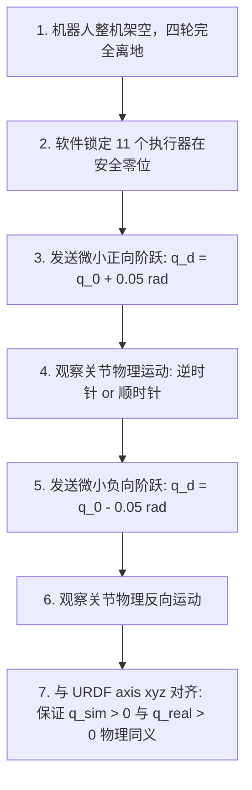

# M1-T02 执行器映射

> **Topic 属性**：StackForce / Topic（执行器与关节拓扑映射）  
> **前置事实证据**：[`E-FW-001`](../../../docs/evidence/E-FW-001-双足轮腿舵机标定固件项目.md), [`E-FW-002`](../../../docs/evidence/E-FW-002-BLDC轮电机驱动固件项目.md), [`E-CAL-001`](../../../docs/evidence/E-CAL-001-实机执行器单通道动作隔离与故障阻断记录.md), [`E-SIM-001`](../../../docs/evidence/E-SIM-001-闭链四足轮腿机器人单父树URDF资产.md)  
> **命名契约**：`_meta/canonical_actuator_map.yaml`, `docs/refactor/canonical-component-topology.md`  
> **语言规范**：中文主体 + English technical terminology / proper nouns

---

## 1. 规范命名与构件映射（Canonical Component SSOT）

> **SSOT 声明**：整机 12 维执行器与主动关节的规范命名拓扑、硬件通道到仿真关节的唯一身份链路，严格以 **`[[T-ACT-001-Canonical-Real-Sim-Component-Identity]]`** 为横向唯一事实源；舵机坐标映射方程（$u_j = u_{0, j} + s_j \cdot k_j \cdot q_j$）与未决标定审计以 **`[[T-ACT-002-Servo-Coordinate-Calibration-Contract]]`** 为唯一事实源。本 Topic 聚焦于 M1 硬件阶段的物理连线排布与架空测试规程。

根据项目冻结的命名契约，机器狗整机包含 **12 个主动执行器**（8 个腿部舵机 + 4 个轮电机），对应驱动 **12 个主动关节**，其标准数组顺序固定如下：

```python
CANONICAL_ACTUATED_JOINTS = [
    # Front-Left Leg (FL)
    "FL_Outer_Hip_Joint", "FL_Inner_Hip_Joint", "FL_Wheel_Joint",
    # Front-Right Leg (FR)
    "FR_Outer_Hip_Joint", "FR_Inner_Hip_Joint", "FR_Wheel_Joint",
    # Rear-Left Leg (RL)
    "RL_Outer_Hip_Joint", "RL_Inner_Hip_Joint", "RL_Wheel_Joint",
    # Rear-Right Leg (RR)
    "RR_Outer_Hip_Joint", "RR_Inner_Hip_Joint", "RR_Wheel_Joint",
]
```

五杆机构的 8 个膝部铰接为被动关节（`{LEG}_{BRANCH}_Knee_Joint`，`PASSIVE`），4 个闭环切断处铰接为闭环约束副（`{LEG}_Closure_Joint`，`LOOP_CLOSURE`，见 [`E-SIM-001#P03`](../../../docs/evidence/E-SIM-001-闭链四足轮腿机器人单父树URDF资产.md) 与 `[[T-ACT-001-Canonical-Real-Sim-Component-Identity]]`）。

---

## 2. 舵机板级接线与通道分配（Servo Board-Level Registration）

8 路腿部舵机集中接入 Stack B 的 PCA9685PW 扩展板，完整物理通道映射表见 `[[T-ACT-001-Canonical-Real-Sim-Component-Identity]]` 与 `[[T-ACT-002-Servo-Coordinate-Calibration-Contract]]`。板级硬件约束如下：

- **硬件驱动参数**：`PCA9685PW`（I2C 地址 `0x40`），PWM 频率 `50 Hz`，API 脉宽范围 `500–2500 μs`（映射 0–300°），硬件使能引脚为 `GPIO 42`（`E-HW-002#P04`）。
- **关键物理限制**：舵机无内部编码器反馈接口，不可用于电机端 PD 闭环，仅接受开环 PWM 角度指令（`E-FW-001#P03`）。
- **通道状态摘要**：`E-CAL-001#P04` 保留 2026-09-10 PCA7 non-return 历史事实；后续 `E-M1-002#P04` powered all-channel regression 覆盖 PCA1-PCA8，Human 报告 safety/return NORMAL，因此当前执行器映射不再受 ch7 阻断。绝对 polarity 仍归 Deployment。

---

## 3. 轮电机接口基线（Wheel Motor Baseline）

| 物理轮位置 | 规范执行器标识符 (Canonical Actuator) | 驱动轮旋转轴 (Canonical Joint) | 控制总线与接口 | 命令模式 (Command Mode) |
| :--- | :--- | :--- | :--- | :--- |
| **右前轮** | `FR_Wheel_Motor` | `FR_Wheel_Joint` | Device `0x02`, CAN target1 (`M4Dir`) | Mode 4 (`TORQUE_MODE`) |
| **左前轮** | `FL_Wheel_Motor` | `FL_Wheel_Joint` | Device `0x02`, CAN target2 (`M3Dir`) | Mode 4 (`TORQUE_MODE`) |
| **左后轮** | `RL_Wheel_Motor` | `RL_Wheel_Joint` | Device `0x01`, Serial2 M0 (`M0_Vel`) | Mode 4 (`TORQUE_MODE`) |
| **右后轮** | `RR_Wheel_Motor` | `RR_Wheel_Joint` | Device `0x01`, Serial2 M1 (`M1_Vel`) | Mode 4 (`TORQUE_MODE`) |

- **底层驱动模式确证**：主控固件显式调用 `motors.setModes(4, 4)`，底层静态库头文件确证 Mode 4 为 `TORQUE_MODE`（力矩闭环模式，`E-FW-002#P04`），不能按上层变量名误判为速度控制。
- **前轮速度反馈现状**：Device `0x02` 的 CAN 回传逻辑被官方固件注释（`E-FW-004#P04`），主控 Device `0x01` 当前无法实时感知前轮真实转速。

---

## 4. 架空单执行器小阶跃测试法（Unloaded Tiny-Step Verification Procedure）

为了消除仿真模型与实机运动方向相反的灾难性隐患（`positive = forward` vs `positive = backward`），实机标定必须遵循以下标准测试规程：



### 控制测试金字塔（Order of Verification）
1. **单关节隔离验证**：逐一驱动单舵机，排查死区与极性；
2. **单腿双关节五杆联动**：同时驱动 Outer 与 Inner 舵机，验证闭链可达性；
3. **四腿同向步进**：四腿联动小幅摆动，排查板间供电压降；
4. **单轮电机低速旋转**：小力矩触发轮体转动，确认编码器反馈极性；
5. **四轮原地旋转**：验证差速转向极性。

---

## 5. 证据追溯与外部参考检索路径

- **8 舵机固件配置与 PCA9685 驱动**：[`E-FW-001#P02-P03`](../../../docs/evidence/E-FW-001-双足轮腿舵机标定固件项目.md)
  - 外部检索：`CEG5003/doc/四足机器人-origin/2程序/bipedal_calibrate/src/main.cpp`
- **BLDC 力矩模式与串口驱动**：[`E-FW-002#P04-P05`](../../../docs/evidence/E-FW-002-BLDC轮电机驱动固件项目.md)
  - 外部检索：`CEG5003/doc/四足机器人-origin/2程序/BLDC_Control/lib/SF_Motor/SF_Motor.h`，搜索 `TORQUE_MODE`
- **历史通道动作隔离与 ch7 failure**：[`E-CAL-001#P01-P05`](../../../docs/evidence/E-CAL-001-实机执行器单通道动作隔离与故障阻断记录.md)
- **当前 powered 全通道回归**：[`E-M1-002#P04`](../../../docs/evidence/E-M1-002-M1实机契约复审与Powered全通道回归.md)
- **四足机器人电气原理图接线真源**：[`E-DOC-004#P02-P03`](../../../docs/evidence/E-DOC-004-四足机器人整机电气接线与总线拓扑指南.md)
- **安全拦截与急停联动专题**：`[[T03-安全联锁]]`
