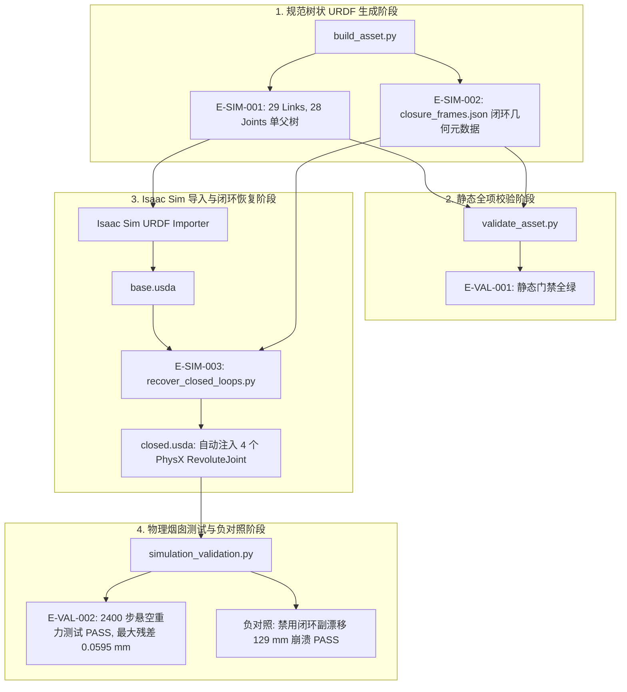

# M2-T08 闭环恢复

> **Topic 属性**：StackForce / Topic（PhysX 闭环约束重构与重力烟囱测试）  
> **前置事实证据**：[`E-SIM-001`](../../../docs/evidence/E-SIM-001-闭链四足轮腿机器人单父树URDF资产.md), [`E-SIM-002`](../../../docs/evidence/E-SIM-002-双支链闭环几何装配不变量与参考系配置.md), [`E-SIM-003`](../../../docs/evidence/E-SIM-003-PhysX闭环副自动重构与USD后处理实现.md), [`E-VAL-002`](../../../docs/evidence/E-VAL-002-强化学习闭环约束收敛与悬空重力烟囱测试报告.md)  
> **命名契约**：`_meta/canonical_actuator_map.yaml`, `docs/refactor/canonical-component-topology.md`  
> **语言规范**：中文主体 + English technical terminology / proper nouns

---

## 1. 架构总览（System Architecture）

在多刚体物理仿真中，机器人双支链五杆闭链机构面临标准 URDF 与关节驱动求解器的双重约束：
1. **URDF 语法约束**：URDF 严格基于有向无环树（Directed Acyclic Tree），不支持多父级拓扑或闭环回路。
2. **多刚体动力学求解约束**：若直接在树形动力学（Featherstone 算法）中建立环，会导致惯性矩阵求解失败；而在仿真器中，必须由 PhysX 等约束求解器在笛卡尔空间施加等式约束来维持闭环。

因此，本项目采用成熟且可控的工业级架构：
**树状拓扑 Loop-Cut URDF + 显式闭环元数据 + 导入后 PhysX 闭环副重构 + 悬空物理烟囱验证**。

---

## 2. 闭环切断与参考系锚点（Loop Cut & Anchor Frames）

在 URDF 资产生成时，每条腿的物理闭环在内侧连杆与驱动轮交会处切断（[`E-SIM-001#P02`](../../../docs/evidence/E-SIM-001-闭链四足轮腿机器人单父树URDF资产.md)）：
- 外侧主链端点注入无质量坐标系：`{LEG}_Wheel_Frame`（固定连接于 `{LEG}_Foot_Link`）；
- 内侧从动臂端点注入无质量坐标系：`{LEG}_Closure_Frame`（固定连接于 `{LEG}_Inner_Calf_Link`）；
- 两参考系在空间上同轴、平行，轴向厚度偏差为固定的 $-44.950\text{ mm}$，径向残差严格小于 $1.83 \times 10^{-17}\text{ m}$（[`E-SIM-002#P01`](../../../docs/evidence/E-SIM-002-双支链闭环几何装配不变量与参考系配置.md)）。

---

## 3. PhysX 闭环副自动注入实现（Post-Processing Implementation）

当 URDF 经 Isaac Sim Importer 解析为基础 USD 阶段后，执行 Python 自动化后处理脚本 `recover_closed_loops.py`（[`E-SIM-003#P01`](../../../docs/evidence/E-SIM-003-PhysX闭环副自动重构与USD后处理实现.md)）：
1. **注入 PhysX 关节**：为每条腿创建 `UsdPhysics.RevoluteJoint`，命名为 `{LEG}_Closure_Joint`；
2. **解耦关节体**：声明属性 `excludeFromArticulation = true`，确保该闭环副由 PhysX 笛卡尔约束求解器处理，不干扰 Featherstone 单父树关节驱动链；
3. **绑定几何关系**：自动读取 `closure_frames.json`，将关节旋转轴设为 Y 轴，对齐轴心。

---

## 4. 物理悬空烟囱测试验证（Gravity Chimney Test）

通过 `simulation_validation.py` 进行 2400 步纯重力悬空测试（[`E-VAL-002#P02`](../../../docs/evidence/E-VAL-002-强化学习闭环约束收敛与悬空重力烟囱测试报告.md)）：
- **正对照通过判定**：在 2400 仿真步内，四腿闭环切断点处的约束残差漂移最大仅为 $0.0595\text{ mm} \le 0.060\text{ mm}$，五连杆构型收敛稳定，无奇异发散。
- **负对照破坏测试**：在运行时传入 `--disable-closures` 禁用 4 个 `{LEG}_Closure_Joint`，小腿连杆在重力作用下下垂分离达 $129\text{ mm}$ 触发碰撞崩溃，确证了闭环副的实际物理约束效力。

---

## 5. 证据追溯与外部参考检索路径

- **单父树闭链 URDF 资产规范**：[`E-SIM-001#P01-P03`](../../../docs/evidence/E-SIM-001-闭链四足轮腿机器人单父树URDF资产.md)
- **闭环参考系测量元数据真源**：[`E-SIM-002#P01-P03`](../../../docs/evidence/E-SIM-002-双支链闭环几何装配不变量与参考系配置.md)
- **USD 闭环副自动注入脚本源码**：[`E-SIM-003#P01-P02`](../../../docs/evidence/E-SIM-003-PhysX闭环副自动重构与USD后处理实现.md)
  - 外部检索：`scripts/recover_closed_loops.py`
- **悬空重力烟囱测试机器报告**：[`E-VAL-002#P01-P03`](../../../docs/evidence/E-VAL-002-强化学习闭环约束收敛与悬空重力烟囱测试报告.md)
  - 外部检索：`validation/rl_qualification.json`
- **机械拓扑与驱动自由度专题**：`[[M2-T02-机械拓扑]]`
