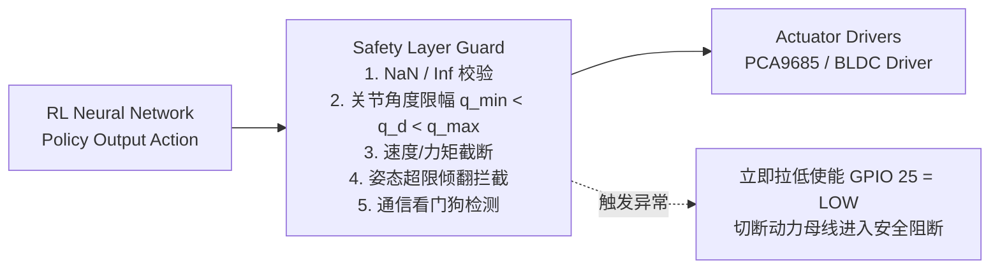

# T03 安全联锁

> **Topic 属性**：StackForce / Topic（多层安全联锁、守卫流与看门狗断电架构）  
> **前置事实证据**：[`E-TEST-001`](../../../docs/evidence/E-TEST-001-实机架空通信时序与固件超时停机测定.md), [`E-CAL-001`](../../../docs/evidence/E-CAL-001-实机执行器单通道动作隔离与故障阻断记录.md)  
> **语言规范**：中文主体 + English technical terminology / proper nouns

---

## 1. 核心铁律：强化学习不可绕过安全层（Unbreakable Safety Boundary）

在物理实体机器狗测试与 Sim-to-Real 部署中，神经网络策略输出具有随机探索性与不可预测性。系统必须确立最高级安全铁律：
> **强化学习策略（RL Policy）绝不能直接驱动底层执行器，任何 Action 必须经由确定性的独立安全层（Safety Layer）守卫过滤！**

---

## 2. 软件安全守卫矩阵（Software Guard Layer）

在 `StackForceRobot.send_action()` 中内置严格防御性逻辑：

1. **数值纯洁性断言（NaN / Inf Rejection）**：
   - 若策略输出包含任何 `NaN`、`Inf` 或超出浮点正常范围的数值，立即丢弃本帧指令，保持上一周期安全指令，并记录错误计数；若连续 3 帧异常，触发安全失能。
2. **运动学与动力学硬截断（Kinematic Clamping）**：
   $$q_{\min} \le q_d \le q_{\max}, \quad |\dot{q}_d| \le \dot{q}_{\text{safe}}, \quad |\tau_d| \le \tau_{\text{safe}}$$
   - 舵机开环位置指令严格限制在机械安全行程内，避免五杆连杆发生几何死锁或轴承卡死。
3. **倾角倾覆保护（Tilt Limit Watchdog）**：
   - 实时读取 MPU-6050 姿态角（[`E-FW-001#P04`](../../../docs/evidence/E-FW-001-双足轮腿舵机标定固件项目.md)）；
   - 当 $|\text{Roll}| > 35^\circ$ 或 $|\text{Pitch}| > 35^\circ$ 时，判定为机身倾覆，策略立即切断行走输出，切换为趴下卸荷姿态（Safe Rest Pose）。
4. **通信心跳看门狗（Heartbeat & Freshness）**：
   - 上位机发送指令帧附带单调递增 Sequence ID；
   - 若超过 `100 ms` 未收到新动作帧，将轮电机指令自动清零；
   - 若通信中断超过 `500 ms`，底层固件硬件级看门狗触发，关闭电机使能输出（实测停机时间为 `501.535–502.498 ms`，[`E-TEST-001#P03`](../../../docs/evidence/E-TEST-001-实机架空通信时序与固件超时停机测定.md)）。

---

## 3. 硬件级物理急停与故障阻断（Hardware E-Stop & Physical Isolation）

1. **急停按键与物理断电**：
   - 遥控器拨杆 SWD 设置为硬件急停锁（[`E-DOC-002#P02`](../../../docs/evidence/E-DOC-002-StackForce四足狗基本操作说明.md)）；
   - 紧急情况下手动切断电池母线开关，物理阻断 TPS5450 降压模块对 8 路舵机的 7.5V 供电（[`E-HW-002#P03`](../../../docs/evidence/E-HW-002-PCA9685多路舵机与MPU6050扩展板原理图.md)）。
2. **典型故障阻断案例（ch7 持续上抬故障）**：
   - 在 M1 架空实测中，通道 7（`RR_Inner_Servo`）出现上电后持续异常上抬且无法回中现象；
   - **阻断决策**：严格禁止以软件回零假定取代物理检查，立即断开执行器供电母线（Actuator Rail），在完成通道隔离与硬件修复前，禁止进行整机通电行走实验（[`E-CAL-001#P03`](../../../docs/evidence/E-CAL-001-实机执行器单通道动作隔离与故障阻断记录.md)）。

---

## 4. 证据追溯与外部参考检索路径

- **实机架空通信超时停机实测数据**：[`E-TEST-001#P03`](../../../docs/evidence/E-TEST-001-实机架空通信时序与固件超时停机测定.md)
  - 外部检索：`timing_latency.csv`
- **执行器通道故障与母线断电阻断记录**：[`E-CAL-001#P03`](../../../docs/evidence/E-CAL-001-实机执行器单通道动作隔离与故障阻断记录.md)
  - 外部检索：`safety_validation.md`
- **遥控器按键急停配置规程**：[`E-DOC-002#P02`](../../../docs/evidence/E-DOC-002-StackForce四足狗基本操作说明.md)
- **多路舵机电源隔离与降压电路**：[`E-HW-002#P03`](../../../docs/evidence/E-HW-002-PCA9685多路舵机与MPU6050扩展板原理图.md)
- **统一机器人接口 API 专题**：`[[T01-机器人接口]]`
