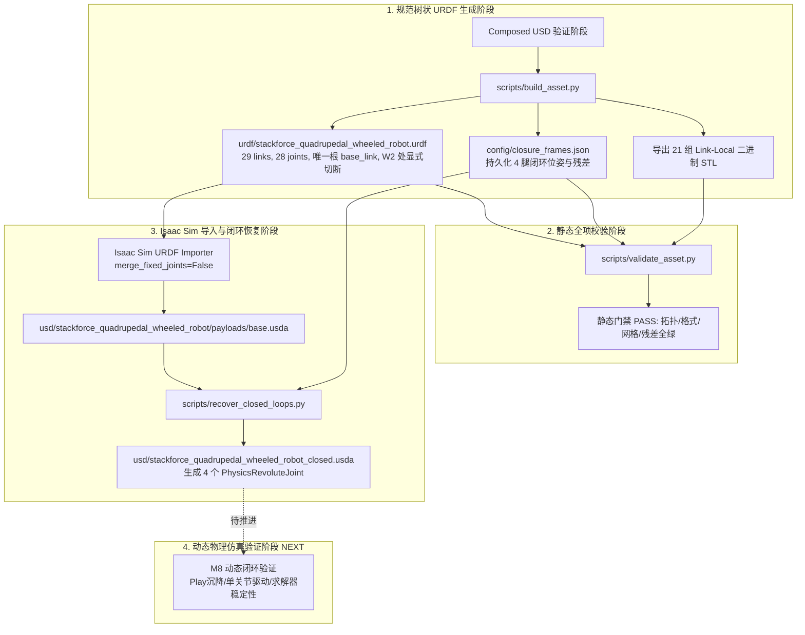

# 闭环恢复架构与产物映射

> 本页属于：stackforce 机器狗实战（topic）  
> 状态：CANONICAL IMPLEMENTATION（八链闭环机器人标准实现）

---

## 架构总览（System Architecture）

在多刚体物理仿真中，机器人闭链机构（五杆机构）面临标准 URDF 与关节驱动求解器的双重约束：
1. **URDF 语法约束**：URDF 严格基于有向无环树（Directed Acyclic Tree），不支持多父级拓扑或闭环回路。
2. **多刚体动力学求解约束**：若直接在树形动力学（Featherstone 算法）中建立环，会导致惯性矩阵求解失败；而在仿真器中，必须由 PhysX 等约束求解器在笛卡尔空间施加等式约束来维持闭环。

因此，本项目采用成熟且可控的工业级架构：
**树状拓扑 Loop-Cut URDF + 显式闭环元数据 + 导入后 PhysX 闭环副重构**。



---

## URDF 规范树状拓扑（Loop-Cut Tree）

### 构件分布（29 Links / 28 Joints）
- 1 个根节点：`base_link`
- 每条腿 7 个 link：
  - 外链：`{LEG}_thigh_Link`、`{LEG}_calf_Link`、`{LEG}_foot_Link`、`{LEG}_W1_frame`（固定在 `foot_Link`）
  - 内链：`{LEG}_inner_upper_Link`、`{LEG}_inner_lower_Link`、`{LEG}_W2_frame`（固定在 `inner_lower_Link`）
- 每条腿 7 个 joint：
  - 主动转动副：`{LEG}_thigh_joint`（M1）、`{LEG}_M2_joint`（M2）
  - 铰接转动副：`{LEG}_calf_joint`（P1）、`{LEG}_P2_joint`（P2）、`{LEG}_foot_joint`（W1）
  - 定位固定副：`{LEG}_W1_frame_joint`、`{LEG}_W2_frame_joint`

### Loop-Cut 设计原则
- $W_2$ 坐标系仅作为 `inner_lower_Link` 的定位叶子节点；
- `foot_Link` 的 parent 仅为 `calf_Link`，绝不与 `inner_lower_Link` 产生父子关系；
- 避免了任何解析器报错与动力学树环状死锁。

---

## 闭环元数据规范（closure_frames.json）

文件位置：`sf_quad/source/sf_quad/sf_quad/assets/robots/stackforce_quadrupedal_wheeled_robot/config/closure_frames.json`

记录了四腿在 `base_link` 局部坐标系下的三维几何关系：
- **共同机械轴向**：FR 与 RR 沿 $[1, 0, 0]$（含极微底盘微偏 $3.74	imes 10^{-6}$），FL 与 RL 沿 $[-1, 0, 0]$。
- **轴向偏置（axial_offset_m）**：四腿一致为 $-0.04494984724564133\text{ m}$（$-44.950\text{ mm}$）。
- **径向投影残差（radial_residual_m）**：四腿一致为 $1.8336827645404186\times 10^{-17}\text{ m}$，机器校验严格共线。
- **P2 轴向偏置（p2_axis_offset_m）**：$0.013650002766096564\text{ m}$（$13.650\text{ mm}$）。
- **P2 表面间隙（p2_surface_gap_m）**：$0.00014999979090898725\text{ m}$（$0.150\text{ mm}$）。

---

## PhysX 闭环重构算法（recover_closed_loops.py）

文件位置：`sf_quad/source/sf_quad/sf_quad/assets/robots/stackforce_quadrupedal_wheeled_robot/scripts/recover_closed_loops.py`

### 算法核心逻辑
1. 遍历四腿，定位 `inner_lower_Link`、`foot_Link` 与 `W2_frame`。
2. 提取 $W_2$ 在世界坐标系下的位置与轴向单位向量。
3. 构造以轴向为局部 X 轴的正交基旋转矩阵，组合得到公共铰链世界位姿 $T_{\text{common\_world}}$。
4. **独立反求局部变换**：
   $$T_{\text{local0}} = T_{\text{common\_world}} \cdot (T_{\text{world\_inner\_lower}})^{-1}$$
   $$T_{\text{local1}} = T_{\text{common\_world}} \cdot (T_{\text{world\_foot}})^{-1}$$
   分别提取平移 $\mathbf{p}_0, \mathbf{p}_1$ 与四元数 $\mathbf{q}_0, \mathbf{q}_1$。
5. 在 `closure_joints` 作用域下定义 `UsdPhysics.RevoluteJoint`：
   - 关联刚体：`body0 = inner_lower_Link`，`body1 = foot_Link`；
   - 填入独立局部变换 `localPos0/1` 与 `localRot0/1`；
   - `physics:axis = "X"`；
   - `physics:collisionEnabled = false`；
   - `physics:excludeFromArticulation = true`。

---

## 静态校验器实现（validate_asset.py）

文件位置：`sf_quad/source/sf_quad/sf_quad/assets/robots/stackforce_quadrupedal_wheeled_robot/scripts/validate_asset.py`

可直接在任意 Python3 环境下执行（无需 Isaac Sim 依赖）：
```bash
python3 sf_quad/source/sf_quad/sf_quad/assets/robots/stackforce_quadrupedal_wheeled_robot/scripts/validate_asset.py
```
**校验内容与输出断言**：
- [x] 解析 URDF，检验是否每个 child 仅有一个 parent（树结构断言）；
- [x] 检验根节点是否唯一且为 `base_link`；
- [x] 检验四腿 7 大关键 links 是否完整存在；
- [x] 检验 `closure_frames.json` 中径向残差是否 $\le 2.0\times 10^{-6}\text{ m}$；
- [x] 检验 URDF 引用的 21 个 mesh 文件是否存在且二进制 STL 文件头完整合法；
- [x] 成功输出：`PASS: 29 links, 28 joints, 21 meshes, 4 closure-frame pairs`。

---

## 产物角色与路径映射表（Artifact Map）

| 资产文件路径 | 角色与功能 | 验证方式 |
|---|---|---|
| `sf_quad/source/sf_quad/sf_quad/assets/robots/stackforce_quadrupedal_wheeled_robot/urdf/stackforce_quadrupedal_wheeled_robot.urdf` | 规范树状 URDF，8 条链，单父级无环 | `validate_asset.py` |
| `sf_quad/source/sf_quad/sf_quad/assets/robots/stackforce_quadrupedal_wheeled_robot/config/closure_frames.json` | 四腿闭环参考系元数据，持久化位姿与残差 | `validate_asset.py` |
| `sf_quad/source/sf_quad/sf_quad/assets/robots/closed_link_robot/ref_b_real_fr/four_inner_chains_validation.json` | 四腿几何验证前置报告（对称性、杆长、配合间隙） | `build_asset.py` |
| `sf_quad/source/sf_quad/sf_quad/assets/robots/stackforce_quadrupedal_wheeled_robot/scripts/build_asset.py` | 确定性资产生成脚本（提取 STL、生成 URDF 与 USD） | Isaac Sim python 执行 |
| `sf_quad/source/sf_quad/sf_quad/assets/robots/stackforce_quadrupedal_wheeled_robot/scripts/validate_asset.py` | 静态资产校验器，断言拓扑、网格与残差 | `python3` 独立执行 |
| `sf_quad/source/sf_quad/sf_quad/assets/robots/stackforce_quadrupedal_wheeled_robot/scripts/recover_closed_loops.py` | PhysX 闭环转动副恢复脚本，生成闭链 USD | Isaac Sim python 执行 |
| `sf_quad/source/sf_quad/sf_quad/assets/robots/stackforce_quadrupedal_wheeled_robot/usd/stackforce_quadrupedal_wheeled_robot_closed.usda` | 包含 4 个 PhysX 闭环副的最终数字孪生资产 | Isaac Sim GUI 审查 |
| `sf_quad/source/sf_quad/sf_quad/assets/robots/stackforce_quadrupedal_wheeled_robot/meshes/*.stl` | 21 组 Link-Local 对齐的规范二进制网格 | 二进制头与法线校验 |

---

## 动态闭环验证路线图（M8 验收协议）

当前资产已通过静态验证，动态仿真验证将按以下步骤展开：

1. **Step 1: 零指令稳态沉降（Zero-Command Settle）**：
   - 将机器人置于空中微距释放，物理步长 $dt = 0.005\text{ s}$；
   - 观察 200 步重力自然下沉，检验闭环副是否承受自重而不撕裂，位移无飞散。
2. **Step 2: 单关节驱动阶跃响应（Single-Joint Actuation）**：
   - 对 M1/M2 施加位置阶跃目标，检验内链被动 P2 关节跟随曲线与速度连续性。
3. **Step 3: 闭环残差动态监控（Dynamic Residual Monitor）**：
   - 运动过程中记录 $W_2$ 与 $W_1$ 闭环连接点的实时世界欧氏距离，确认物理约束误差保持在允许范围。
4. **Step 4: 四腿协调与接触激活（Four-Leg Motion & Contact Sanity）**：
   - 恢复自碰撞与地面接触，检验四腿协同伸缩下的求解器收敛性与数值稳定性。

---

## 更新日志

- 2026-09-13：根据当前工程实际实现的闭环资产与工具链建立架构专题，记录 29 links / 28 joints 规范树、`closure_frames.json` 元数据、`recover_closed_loops.py` 恢复算法及完整产物映射。
