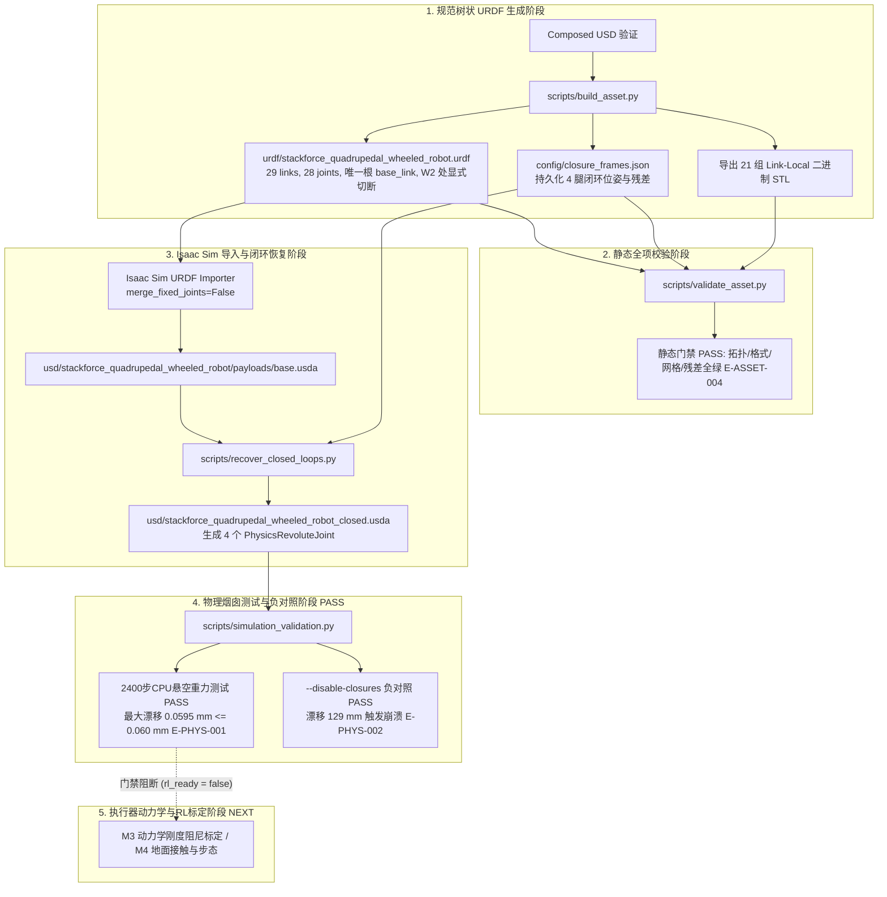

# 闭环恢复架构与产物映射

> 本页属于：stackforce 机器狗实战（topic）  
> 状态：CANONICAL IMPLEMENTATION（八链闭环机器人标准实现）  
> 证据规范：**A PATH IS NOT EVIDENCE.** 证据块由 [[evidence-registry]] 统一定义，绝对路径仅作为本地可选定位符。

---

## 架构总览（System Architecture）

在多刚体物理仿真中，机器人闭链机构（五杆机构）面临标准 URDF 与关节驱动求解器的双重约束：
1. **URDF 语法约束**：URDF 严格基于有向无环树（Directed Acyclic Tree），不支持多父级拓扑或闭环回路。
2. **多刚体动力学求解约束**：若直接在树形动力学（Featherstone 算法）中建立环，会导致惯性矩阵求解失败；而在仿真器中，必须由 PhysX 等约束求解器在笛卡尔空间施加等式约束来维持闭环。

因此，本项目采用成熟且可控的工业级架构：
**树状拓扑 Loop-Cut URDF + 显式闭环元数据 + 导入后 PhysX 闭环副重构 + 悬空物理烟囱验证**。

---

## 机器人自由度与驱动拓扑划分（Actuation Partition）

整机拓扑严谨划分为以下构件与关节（`E-MECH-002`）：
- **20 个树状转动关节（Tree Revolute Joints）**：4 腿 $\times$ 5 个（M1, P1, W1, M2, P2）。
- **12 个主动驱动自由度（Active Actuated DOFs）**：4 腿 $\times$ (M1 + M2 + W1)。
- **8 个被动转动铰接（Passive Revolute Joints）**：4 腿 $\times$ (P1 + P2)。
- **4 个闭环运动学约束副（Closure Constraints）**：4 腿 $\times$ W2 闭环转动副（PhysX 约束，`excludeFromArticulation=true`）。

> [!IMPORTANT]
> **机构语义划分 vs 仿真执行器配置边界**：
> 机械语义上 P1/P2 为纯被动转动副（Passive）。但在当前 URDF 导入生成的 USD 中，Isaac Sim URDF Importer 为所有 20 个树状转动关节自动挂载了默认的 `PhysicsDriveAPI:angular`（stiffness=0, damping=0）。
> 目前尚未完成驱动器真实刚度、阻尼与动力学特性的标定，资产处于 **`rl_ready = false`** 状态（见 `E-RL-001`）。

---

## URDF 规范树状拓扑（Loop-Cut Tree）

### 构件分布（29 Links / 28 Joints）
- 1 个根节点：`base_link`
- 每条腿 7 个 link：
  - 外链：`{LEG}_thigh_Link`、`{LEG}_calf_Link`、`{LEG}_foot_Link`、`{LEG}_W1_frame`（固定在 `foot_Link`）
  - 内链：`{LEG}_inner_upper_Link`、`{LEG}_inner_lower_Link`、`{LEG}_W2_frame`（固定在 `inner_lower_Link`）
- 每条腿 7 个 joint：
  - 主动转动副：`{LEG}_thigh_joint`（M1）、`{LEG}_M2_joint`（M2）
  - 铰接转动副：`{LEG}_calf_joint`（P1）、`{LEG}_P2_joint`（P2）、`{LEG}_foot_joint`（W1）
  - 定位固定副：`{LEG}_W1_frame_joint`、`{LEG}_W2_frame_joint`

### Loop-Cut 设计原则
- $W_2$ 坐标系仅作为 `inner_lower_Link` 的定位叶子节点；
- `foot_Link` 的 parent 仅为 `calf_Link`，绝不与 `inner_lower_Link` 产生父子关系；
- 避免了任何解析器报错与动力学树环状死锁（`E-ASSET-001`）。

---

## 闭环元数据规范（closure_frames.json）

文件位置：`sf_quad/.../config/closure_frames.json` (`E-ASSET-002`)

记录了四腿在 `base_link` 局部坐标系下的三维几何关系：
- **共同机械轴向**：FR 与 RR 沿 $[1, 0, 0]$（含极微底盘微偏 $3.74 \times 10^{-6}$），FL 与 RL 沿 $[-1, 0, 0]$。
- **轴向偏置（axial_offset_m）**：四腿一致为 $-0.04494984724564133\text{ m}$（$-44.950\text{ mm}$）。
- **径向投影残差（radial_residual_m）**：四腿一致为 $1.8336827645404186\times 10^{-17}\text{ m}$，机器校验严格共线。
- **P2 轴向偏置（p2_axis_offset_m）**：$0.013650002766096564\text{ m}$（$13.650\text{ mm}$）。
- **P2 表面间隙（p2_surface_gap_m）**：$0.00014999979090898725\text{ m}$（$0.150\text{ mm}$）。

---

## PhysX 闭环重构算法（recover_closed_loops.py）

文件位置：`sf_quad/.../scripts/recover_closed_loops.py` (`E-ASSET-003`)

### 算法核心逻辑
1. 遍历四腿，定位 `inner_lower_Link`、`foot_Link` 与 `W2_frame`。
2. 提取 $W_2$ 在世界坐标系下的位置与轴向单位向量。
3. 构造以轴向为局部 X 轴的正交基旋转矩阵，组合得到公共铰链世界位姿 $T_{\text{common\_world}}$。
4. **独立反求局部变换**：
   $$T_{\text{local0}} = T_{\text{common\_world}} \cdot (T_{\text{world\_inner\_lower}})^{-1}$$
   $$T_{\text{local1}} = T_{\text{common\_world}} \cdot (T_{\text{world\_foot}})^{-1}$$
   分别提取平移 $\mathbf{p}_0, \mathbf{p}_1$ 与四元数 $\mathbf{q}_0, \mathbf{q}_1$。
5. 在 `closure_joints` 作用域下定义 `UsdPhysics.RevoluteJoint`：
   - 关联刚体：`body0 = inner_lower_Link`，`body1 = foot_Link`；
   - 填入独立局部变换 `localPos0/1` 与 `localRot0/1`；
   - `physics:axis = "X"`；
   - `physics:collisionEnabled = false`；
   - `physics:excludeFromArticulation = true`。

---

## 物理烟囱测试与负对照协议（simulation_validation.py）

文件位置：`sf_quad/.../scripts/simulation_validation.py` (`E-PHYS-001`, `E-PHYS-002`)

### 1. 正向物理烟囱测试（2400 步 CPU 悬空重力仿真）
- **环境设置**：CPU 悬空固定 `base_link`，重力场 $g = -9.81\text{ m/s}^2$，$dt = 1/240\text{ s}$（240 Hz），运行 2400 步（$10.0\text{ s}$）。
- **实测结果**：
  - 测得连杆运动位移 `body_motion_m = 0.0906 m`（排除未实际积分的静止假象）；
  - 四腿闭环最大锚点漂移：FR $0.0518\text{ mm}$，FL $0.0515\text{ mm}$，RL $0.0528\text{ mm}$，RR $0.0595\text{ mm}$（最大值 $\le 0.060\text{ mm}$，远低于 $1\text{ mm}$ 容差上限）；
  - 四腿闭环最大转轴角度误差：$\le 5.23 \times 10^{-6}\text{ rad}$（远低于 $0.01\text{ rad}$ 门禁）；
  - 判定结果：`static_status = PASS`, `simulation_status = PASS`。

### 2. 负对照测试（--disable-closures）
- **机制**：通过在测试中对 4 个闭环副调用 `CreateJointEnabledAttr(False)` 显式关闭约束。
- **实测结果**：
  - 闭环副失效后，内链与外链在重力作用下拉脱；
  - 四腿闭环漂移迅速上升至约 $129\text{ mm}$（$0.129\text{ m}$）；
  - 在第 480 步（$t = 2.0\text{ s}$）因漂移超限触发异常：`RuntimeError: Closure drift exceeds smoke-test limits (1 mm / 0.01 rad)` 并崩溃。
  - **科学推论**：证明在正向测试中闭环约束的保持完全来自 PhysX 关节动力学约束求解，而非初始位姿的几何巧合。

---

## 产物角色与路径映射表（Artifact Map）

| 规范相对路径（以 `$PROJECT_ROOT` 为基准） | 工程角色与职责 | 验证手段与证据 ID |
|---|---|---|
| `sf_quad/.../urdf/stackforce_quadrupedal_wheeled_robot.urdf` | 规范树状 URDF，8 条链，单父级无环 | `validate_asset.py` (`E-ASSET-001`) |
| `sf_quad/.../config/closure_frames.json` | 四腿闭环参考系元数据，持久化位姿与残差 | `validate_asset.py` (`E-ASSET-002`) |
| `sf_quad/.../ref_b_real_fr/four_inner_chains_validation.json` | 四腿几何验证前置报告（对称性、杆长、间隙） | 机器前置检查 (`E-MECH-001`) |
| `sf_quad/.../scripts/build_asset.py` | 确定性资产生成脚本（提取 STL、生成 URDF 与 USD） | Isaac Sim Python |
| `sf_quad/.../scripts/validate_asset.py` | 静态资产校验器，断言拓扑、网格与残差 | `python3` 独立执行 (`E-ASSET-004`) |
| `sf_quad/.../scripts/recover_closed_loops.py` | PhysX 闭环转动副恢复脚本，生成闭链 USD | Isaac Sim Python (`E-ASSET-003`) |
| `sf_quad/.../usd/stackforce_quadrupedal_wheeled_robot_closed.usda` | 包含 4 个 PhysX 闭环副的数字孪生资产 | Isaac Sim 物理仿真 (`E-ASSET-003`) |
| `sf_quad/.../scripts/simulation_validation.py` | 物理烟囱测试与负对照验证脚本 | Isaac Sim Python (`E-PHYS-001`) |
| `sf_quad/.../validation/simulation_report.json` | 2400 步重力仿真测试通过报告 | 机器可读 JSON (`E-PHYS-001`) |
| `sf_quad/.../validation/negative_control_report.json` | 负对照崩溃检验报告 | 机器可读 JSON (`E-PHYS-002`) |

---

## 更新日志

- 2026-09-14：补充 2400 步 CPU 悬空重力烟囱测试（0.060 mm 漂移 PASS）与负对照（129 mm 崩溃 PASS）实验结果；更新驱动拓扑划分为 20 树关节 / 12 主动 / 8 被动 / 4 约束；明确 `rl_ready = false` 边界；全面采用便携式路径与 [[evidence-registry]] 关联。
- 2026-09-13：根据当前工程实际实现的闭环资产与工具链建立架构专题，记录 29 links / 28 joints 规范树、`closure_frames.json` 元数据、`recover_closed_loops.py` 恢复算法及完整产物映射。
