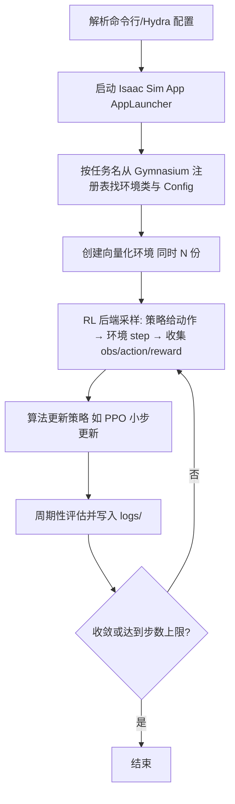

# Isaac-Lab项目结构与训练流程

> 本页属于：train 训练入门
> 前置知识：[[强化学习核心概念]]
> 预计阅读时间：15 分钟

## 这是什么工具？

本页带你读懂 Isaac Lab 源码目录，并说清 `train.py` 背后发生了什么。类比：**看懂一座工厂的车间布局和流水线**，之后你才知道该去哪个车间改哪台机器。

## 核心概念

| 概念 | 是什么 | 类比 |
|------|--------|------|
| **核心包 `isaaclab`** | 框架主体：环境、管理器、场景、传感器等 | 工厂的机床本体 |
| **`isaaclab_assets`** | 机器人/物体的 USD 资产与配置 | 标准零件库 |
| **`isaaclab_tasks`** | 各种现成任务（Cartpole、Ant、机械臂…） | 已排好的成品产线 |
| **`isaaclab_rl`** | 对接 rsl_rl/skrl/sb3 等 RL 库的封装 | 训练车间的接口 |
| **Manager-Based vs Direct** | 两种定义环境的工作流 | 乐高积木式 vs 一体成型 |
| **Config（`@configclass`）** | 用类字段描述环境参数，支持命令行覆盖 | 机器的"参数面板" |

## 目录结构（关键部分）

```text
IsaacLab/
├─ source/                      # Python 包都在这
│  ├─ isaaclab/                 # 核心框架（envs/managers/scene/sensors/actuators/sim）
│  ├─ isaaclab_assets/          # 机器人资产（机械臂、四足、人形等配置）
│  ├─ isaaclab_tasks/           # 现成任务定义（manager_based/ direct/ locomotion/…）
│  └─ isaaclab_rl/              # RL 后端封装
├─ scripts/
│  ├─ reinforcement_learning/   # 训练/回放入口
│  │  ├─ train.py               # 通用训练脚本
│  │  ├─ play.py                # 通用回放脚本
│  │  ├─ rsl_rl/                # 后端 1：rsl_rl
│  │  ├─ skrl/                  # 后端 2：skrl
│  │  ├─ sb3/                   # 后端 3：stable-baselines3
│  │  └─ rl_games/              # 后端 4：rl_games
│  └─ environments/
│     └─ list_envs.py           # 列出所有已注册环境
├─ apps/                        # Isaac Sim App 的 .kit 启动配置
├─ docker/                      # 容器部署
└─ isaaclab.sh                  # 一键入口（install/python 等）
```

> 这是 Isaac Lab main 分支的实际结构（2026-08-31 核对）。你训练时最常接触的是 `scripts/reinforcement_learning/` 和 `source/isaaclab_tasks/`。

## 两种工作流

| | **Direct** | **Manager-Based** |
|---|---|---|
| 思路 | 在环境类里直接写物理、奖励、重置逻辑 | 用"管理器"模块拼装动作/观测/奖励/终止/指令/随机化 |
| 优点 | 路径最短，直观 | 模块化、可复用、易扩展 |
| 适合 | 快速原型、自定义小众任务 | 通用开发、复杂机器人任务 |
| 代表任务 | `Isaac-Cartpole-Direct-v0` | `Isaac-Cartpole-v0` |

本讲义 train 第一次自建任务推荐 **Direct**（更快跑通），进阶后再学 Manager-Based。

## 训练流程（`train.py` 背后）



## 常见问题 FAQ

**Q1：`--task` 的值从哪来？**
来自环境注册时 `gym.register(id="...-v0")` 的 id。用 `scripts/environments/list_envs.py` 查看全部。

**Q2：`--num_envs` 和 Config 里的 `num_envs` 谁说了算？**
命令行参数会覆盖 Config 里的对应字段（Hydra 机制）。

**Q3：想换训练算法怎么办？**
换脚本目录即可：`scripts/reinforcement_learning/rsl_rl/train.py` → `.../skrl/train.py` 等。

**Q4：`isaaclab_tasks` 里找不到我想要的任务？**
自建任务放自己的项目里，用 `./isaaclab.sh --new` 生成模板，见 [[第一个训练任务]]。

## 速查卡片

```text
看环境: scripts/environments/list_envs.py
训练:   scripts/reinforcement_learning/<backend>/train.py --task <Task> --num_envs N
回放:   scripts/reinforcement_learning/<backend>/play.py --task <Task> --num_envs N
新项目: ./isaaclab.sh --new
核心包: source/isaaclab (框架) / isaaclab_assets (资产) / isaaclab_tasks (任务)
```

## 本章小结

- Isaac Lab 采用"核心框架 + 资产 + 任务 + RL 封装"的分层结构。
- 训练入口是 `train.py`，通过 Gymnasium 注册表按任务名找到环境。
- Direct 与 Manager-Based 是两种环境定义工作流。
- Config（`@configclass` + Hydra）让参数可配置、可被命令行覆盖。

## 下一步

- 上一页：[[强化学习核心概念]]
- 下一页：[[第一个训练任务]]
- 返回：[[Home]]

## 更新日志

- 2026-08-31：新增本页。来源：Isaac Lab 文档与源码目录（<https://github.com/isaac-sim/IsaacLab>、<https://isaac-sim.github.io/IsaacLab/v2.3.2/source/setup/quickstart.html>）（访问于 2026-08-31）。
