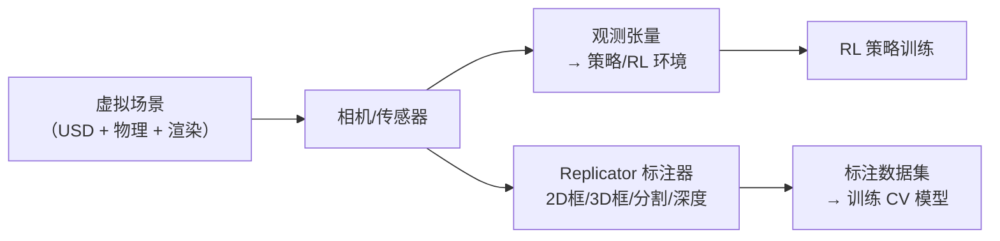

# 传感器与合成数据

> 本页属于：train 训练入门
> 前置知识：[[第一个训练任务]]
> 预计阅读时间：20 分钟

## 🎯 为什么需要这个？

机器人不能只靠"上帝视角"的真值状态（`"critic"` 特权观测）——真机上它只能靠**传感器**看世界。想让策略学会"用传感器感知后决策"（端到端/视觉策略），或者给视觉模型（YOLO 等）准备训练数据，都需要两件事：**在仿真里加传感器**、**批量生成标注数据（合成数据）**。这正是 Isaac Sim 对比普通仿真器的杀手级能力。

## 💡 一个类比

- **传感器** = 机器人的"五官"：相机（眼睛）、LiDAR（测距雷达）、IMU（内耳平衡感）、接触传感器（触觉）。
- **合成数据** = 用电脑"批量拍照出题"：让虚拟相机在成千上万种场景/角度下拍摄，自动生成标注（框、遮罩、深度），相当于**请了个从不累的摄影师 + 自动批改老师**，专门喂给视觉 AI。

## 🐍 最小必要知识

| 概念 | 是什么 | 类比 |
|------|--------|------|
| **Camera（相机）** | RGB/深度图传感器，最常见的"眼睛" | 眼睛/摄像头 |
| **LiDAR（激光雷达）** | 按角度发射激光测距，得到点云 | 超声波测距的加强版 |
| **IMU（惯性单元）** | 测量加速度与角速度 | 内耳/平衡感 |
| **接触传感器** | 检测是否接触、接触力大小（如脚掌着地） | 触觉 |
| **合成数据（Synthetic Data）** | 仿真里批量生成带标注的图像/数据，训练 CV 模型 | 自动出题+自动批改 |
| **Replicator** | Isaac Sim 的合成数据管线（标注器 + 写入器） | 自动化摄影棚+批改流水线 |
| **RayCaster / 距离传感器** | 射线测距，机器人避障常用（低成本"雷达"） | 便宜的测距仪 |

> Isaac Lab 里传感器通过 `CameraCfg`、`ContactSensorCfg`、`ImuCfg`、`RayCasterCfg` 等配置类接入场景（[[奖励设计与观测修改]] 已见过 CameraCfg/ContactSensorCfg，本页是系统化讲解）。

## 🖼️ 图解：传感器与合成数据的数据流

图 1 传感器读数与合成数据的流向（来源：自绘 Mermaid，本地预览渲染；GitHub Wiki 上以代码块显示；访问于 2026-08-31）



两条用途：**① 传感器→观测→RL**（端到端策略）；**② 传感器→Replicator→数据集→CV 模型**（感知模型）。

## 📝 代码：Isaac Lab 里加传感器（回顾 + 系统化）

```python
from isaaclab.sensors import CameraCfg, ContactSensorCfg, ImuCfg

@configclass
class MyEnvCfg(ManagerBasedRLEnvCfg):
    # ① 相机：装在机器人头部，输出 RGB+深度
    camera = CameraCfg(
        prim_path="{ENV_REGEX_NS}/Robot/head",
        update_period=0.0,          # 每决策周期更新一次（0=跟随决策频率）
        height=64, width=64,        # 分辨率：越小越快（见 仿真加速页）
        data_types=["rgb", "depth"],
    )
    # ① 接触传感器：绑在脚掌，检测着地
    contact_sensor = ContactSensorCfg(
        prim_path="{ENV_REGEX_NS}/Robot/feet",
        update_period=0.0,
        history_length=0,           # 不保留历史
    )
    # ① IMU：测机体加速度/角速度
    imu = ImuCfg(
        prim_path="{ENV_REGEX_NS}/Robot/base",
        update_period=0.0,
    )
```

读法：`prim_path` 指定"装在哪个 prim 上"，`update_period` 决定多久更新一次（越大越省算力），`data_types`/分辨率决定数据量与开销。传感器读数在 `self.camera.data.output`、`self.contact_sensor.data.net_forces_w`、`self.imu.data` 等取用（[[奖励设计与观测修改]] 有使用示例）。

## 📝 一瞥：Replicator 合成数据管线

独立 Isaac Sim 里用 Replicator 批量出标注数据（思路示意，实际用其 API/UI）：

```python
from isaacsim.replicator.core import Replicator
from isaacsim.replicator import annotations   # 标注器：2D 框、分割、深度等

rep = Replicator()                            # ① 建管线
# ② 注册"相机 → 标注器"：每帧对指定相机生成 RGB + 2D 包围框
rep.register_product(camera, [annotations.Rgb(), annotations.BoundingBox2D()])
# ③ 开拍：自动随机化场景并批量生成数据
rep.trigger()                                 # （示意：还有随机化/写入器等配置）
```

- **标注器（annotator）**：Rgb、Depth、BoundingBox2D/3D、SemanticSegmentation（分割）等。
- **写入器（writer）**：把数据写到磁盘（如 BasicWriter，输出到指定目录）。
- 配合场景随机化（[[Domain随机化与Sim2Real]]），合成数据覆盖"千变万化"的视角与光照。

## 🗒️ 常见问题 FAQ

**Q1：相机和"上帝视角"观测，训练出来有什么不同？**
真机只能提供传感器观测；如果训练时只给特权观测，部署时（[[真机部署]]）没有对应输入，策略直接失效。端到端策略必须在训练时就用传感器观测。

**Q2：加了相机训练很慢？**
相机是最贵的传感器。降分辨率、减小 `update_period` 频率、只留用得到的 `data_types`（见 [[仿真加速与性能优化]]）。

**Q3：合成数据和真实数据哪个好？**
互补：合成数据量大、标注免费、可任意随机化；真实数据真实但有标注成本。工业上常用"合成数据预训练 + 少量真实数据微调"。

**Q4：Replicator 和 Isaac Lab 传感器是同一套东西吗？**
不是：Replicator 面向"生成数据集"（标注/批量）；Isaac Lab 的 `CameraCfg` 面向"RL 环境内读取观测"。数据可互相借用：用 Replicator 出数据集训 CV，用 Lab 传感器喂 RL。

## ✏️ 小练习

**1.** 你想让四足机器人"看脚下地形选择落脚点"，应该在环境里加哪种传感器？观测怎么接入策略？

<details>
<summary>查看答案</summary>

加相机（或深度相机）作为观测：`CameraCfg` 注册后，在 `_get_observations()`/观测管理器里把 `camera.data.output["rgb"或"depth"]` 拼进观测。注意部署时（真机）也要有对应的相机输入。
</details>

**2.** 训练 YOLO 检测"箱子"，最省钱高效的标注数据来源是什么？

<details>
<summary>查看答案</summary>

用 Replicator 在仿真里批量生成带 BoundingBox2D 标注的图像（配合场景/光照随机化），再补少量真实数据微调——比人工标注又快又便宜。
</details>

**3.** `update_period` 调大会有什么影响？什么时候该调？

<details>
<summary>查看答案</summary>

调大 = 传感器更新频率降低，省算力但观测"变旧"、控制可能变糙。高频控制任务保持 0（跟随决策频率）；对实时性要求不高的检测/监控可调大。
</details>

## 本章小结

- 传感器 = 机器人的五官：相机/LiDAR/IMU/接触/测距，Isaac Lab 用 `*Cfg` 配置类接入。
- 传感器数据两条流向：进 RL 观测（端到端策略）、进 Replicator 出标注数据集（CV 训练）。
- 合成数据量大、标注免费，与真实数据互补；相机是最贵的传感器，注意分辨率与更新频率。

## 下一步

- 上一页：[[第一个训练任务]]
- 下一页：[[渲染与LiDAR感知]]（渲染与测距：视觉与导航感知）
- 返回：[[Home]]

## 更新日志

- 2026-08-31：新增本页。来源：Isaac Sim Replicator 教程（<https://docs.isaacsim.omniverse.nvidia.com/latest/replicator_tutorials/tutorial_replicator_overview.html>、<https://docs.isaacsim.omniverse.nvidia.com/latest/action_and_event_data_generation/tutorial_replicator_object.html>）、Isaac Lab 传感器 API（<https://isaac-sim.github.io/IsaacLab/source/api/isaaclab/isaaclab.sensors.html>）（访问于 2026-08-31）。
