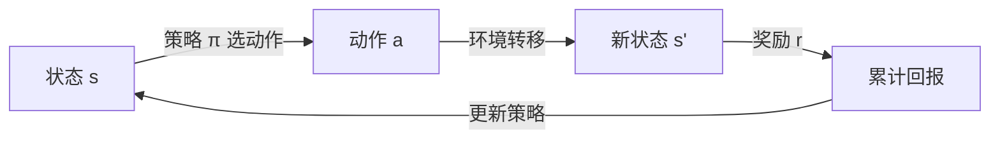

# 强化学习核心概念

> 本页属于：train 训练入门
> 前置知识：[[Isaac-Lab是什么]]（了解"环境、策略、向量化"）、[[运行第一个Demo]]
> 预计阅读时间：15 分钟

## 🎯 为什么需要这个？

在 setup 你按下 `train.py`，机器人就开始"自己学"了。但它是怎么从"乱动"变成"稳稳立住杆子"的？本页补上**强化学习（RL）的最小必要理论**，让你之后看得懂训练日志、改得了奖励函数。

## 💡 一个类比

把训练机器人想象成**训练一只小狗**：

- 你喊"坐下"（给出**状态/观测**：小狗看到你的手势）；
- 小狗选择做一个动作（**动作**：坐 / 不坐）；
- 做对了，你给零食（**奖励** = +1）；做错了，不给（奖励 = 0 或 -1）；
- 小狗慢慢总结"看到这个手势 → 坐 → 有零食"，形成习惯（**策略**）。

强化学习就是这个过程的数学化，只是"小狗"换成了神经网络，而且可以同时训练成千上万只。

## 🐍 最小必要知识

| 术语 | 是什么 | 类比 |
|------|--------|------|
| **MDP（马尔可夫决策过程）** | 描述"状态→动作→奖励→新状态"循环的数学框架 | 一局回合制棋盘游戏的规则 |
| **观测 (observation) / 状态 (state)** | 智能体能看到的当前局面 | 棋手看到的棋盘 |
| **动作 (action)** | 智能体本轮的选择 | 棋手走的那一步 |
| **奖励 (reward)** | 环境对这一步好坏的打分 | 零食 / 扣零食 |
| **策略 (policy)** | 从观测到动作的映射，通常是神经网络 | 棋手的"棋风/习惯" |
| **回报 / 折扣回报** | 一长串奖励的累积（未来奖励略打折） | 不仅看这步，还要看长远收益 |
| **PPO** | 一种常用、稳定的策略优化算法 | "稳扎稳打"的教练，每次只小步调整 |

**一句话记忆**：MDP 规定游戏规则，策略是玩家，PPO 是帮玩家稳步变强的教练。

## 🖼️ 图解：MDP 循环



## 🤖 真实场景：倒立摆 (Cartpole)

以 `Isaac-Cartpole-v0` 为例：

- **观测**：小车位置、小车速度、杆子角度、杆子角速度（4 个数）。
- **动作**：给小车一个向左/向右的力（1 个连续值）。
- **奖励**：每坚持一个时间步 +1；杆子倒下 / 车跑出边界就结束（终止）。
- **目标**：让累积奖励最大，也就是让杆子尽量久地保持竖直。

## 📝 代码/操作示例

Isaac Lab 的环境遵循 Gymnasium 标准接口。最小交互骨架：

```python
import gymnasium as gym

# 1. 创建环境（这里用 Isaac Lab 注册的任务名）
env = gym.make("Isaac-Cartpole-v0", num_envs=32)

# 2. 重置环境，拿到初始观测
obs, info = env.reset()

for _ in range(1000):
    # 3. 智能体根据观测选择动作（这里先用随机动作演示）
    action = env.action_space.sample()
    # 4. 环境执行动作，返回：新观测、奖励、是否终止、是否超时、附加信息
    obs, reward, terminated, truncated, info = env.step(action)
    # 5. 终止或超时就重置
    if terminated or truncated:
        obs, info = env.reset()

env.close()
```

> 真正的训练就是把第 3 步的"随机动作"换成"神经网络策略"，并用 reward 去更新网络参数——这正是 `train.py` 在做的事。

## ✏️ 小练习

**1.** 用 MDP 的四个要素，描述"倒立摆"任务。

<details>
<summary>查看答案</summary>

状态=小车位置/速度 + 杆子角度/角速度；动作=施加给小车水平方向的力；奖励=每坚持一步 +1；转移=物理引擎按动作计算下一步状态；终止=杆倒或车越界。
</details>

**2.** 为什么奖励要"折扣"（未来的奖励打一点折）？

<details>
<summary>查看答案</summary>

因为越远的未来越不确定，且"现在就拿到的收益"更有价值。折扣让智能体既考虑长远，又不过度押注遥远的未来。
</details>

**3.** PPO 相比"每步都大改策略"的做法，好处是什么？

<details>
<summary>查看答案</summary>

PPO 限制每次更新的幅度（小步更新），训练更稳定，不容易因为一次改过头而把之前学到的本领毁掉（catastrophic forgetting / 策略崩溃）。
</details>

**4.** State 和 Observation 有什么区别?

<details>
<summary>查看答案</summary>

State（状态）是环境真实完整的内部状态；Observation（观测）才是 Agent 实际能够感知到的信息。在 Cartpole 这种简单任务可能两者的信息相同。但是想象一个四足机器人。
真实环境状态可能是：

$$ s_t= [ q,\dot q, \text{真实base pose}, \text{真实base velocity}, \text{contact forces}, \text{terrain geometry}, \text{motor temperature}, \ldots ] $$

但是机器人实际只能通过传感器获得：

$$ o_t= [ \text{encoder}, \text{IMU}, \text{camera}, \text{previous action}, \ldots ] $$

机器人通常不知道自己的 true state (仿真器的 ground truth)。机器人可能只有 IMU、encoder 等，然后通过 state estimator 估计。
</details>


## 本章小结

- RL = 智能体在环境中"试错 + 拿奖励"，逐步学会策略。
- MDP 四要素：状态、动作、奖励、转移；策略是观测到动作的映射。
- 目标是最大化（折扣）累积回报；PPO 是稳定常用的优化算法。
- Isaac Lab 环境遵循 Gymnasium 的 `reset()/step()` 接口。

## 下一步

- 上一页：[[学习路线与下一步]]
- 下一页：[[Isaac-Lab项目结构与训练流程]]
- 返回：[[Home]]

## 更新日志

- 2026-08-31：新增本页。来源：Isaac Lab 文档（Reinforcement Learning 章节）、Gymnasium API（<https://isaac-sim.github.io/IsaacLab/>，访问于 2026-08-31）。
