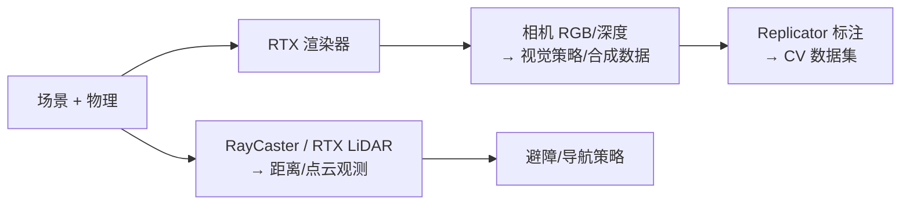

# 渲染与LiDAR感知

> 本页属于：train 训练入门
> 前置知识：[[传感器与合成数据]]
> 预计阅读时间：20 分钟

## 🎯 为什么需要这个？

[[传感器与合成数据]] 讲了"五官"（相机/接触/IMU），但两件 Isaac Sim 的看家本领值得单独展开：**渲染**（合成数据与视觉策略的"画质"来源）和 **LiDAR**（导航/避障任务的标配测距传感器）。本页讲清它们是什么、配置在哪、怎么接入 Isaac Lab 训练。

## 💡 一个类比

- **渲染** = 摄影棚的光线与相机质量：光线追得好（RTX），照片才真实；合成数据就是"用这摄影棚批量拍照出题"。
- **LiDAR** = 拿着手电筒转圈扫射，靠"光回来要多久"测距离：生成一圈圈的距离点（点云），让机器人知道"周围有没有墙"。
- **RayCaster（射线传感器）** = LiDAR 的"便宜平替"：不发真实激光，直接问物理引擎"这条射线撞到啥、多远"，够用且快。

## 🐍 最小必要知识

| 概念 | 是什么 | 类比 |
|------|--------|------|
| **RTX 渲染器** | GPU 光线追踪渲染：照片级光影 | 顶级摄影棚灯光 |
| **光栅化 vs 光追** | 光栅化：快但光影假；光追：慢但真实 | 闪光灯快拍 vs 棚拍精修 |
| **渲染帧率 vs 物理频率** | 渲染和物理可以不同步（渲染慢点没关系） | 摄影师不用跟物理同步每帧按快门 |
| **RTX LiDAR** | Isaac Sim 的激光雷达传感器（真实激光模型） | 高精度激光测距仪 |
| **RayCaster（射线传感器）** | Isaac Lab 的射线距离传感器：向多个方向发射线，返回距离 | 便宜的手电筒测距 |
| **点云（Point Cloud）** | LiDAR 输出的距离点集合（形状 `[num_rays, 3]` 或距离值） | 一圈"障碍物坐标" |

## 🖼️ 图解：渲染与测距在训练中的位置

图 1 渲染/LiDAR 数据流向（来源：自绘 Mermaid，本地预览渲染；GitHub Wiki 上以代码块显示；访问于 2026-08-31）



## 📝 配置示例：Isaac Lab 里加射线传感器与深度相机

```python
from isaaclab.sensors import RayCasterCfg, patterns, CameraCfg

@configclass
class MyEnvCfg(ManagerBasedRLEnvCfg):
    # ① 射线传感器：绕机器人一圈发射 64 条线，探测障碍距离
    ray_caster = RayCasterCfg(
        prim_path="{ENV_REGEX_NS}/Robot/base",
        offset=RayCasterCfg.OffsetCfg(pos=(0.0, 0.0, 0.3)),  # 相对机体位置
        attach_yaw_only=True,               # 只跟随机体偏航（不随俯仰滚转）
        pattern_cfg=patterns.GridPattern(   # 发射图案：环形网格
            lines=64, rings=1,
        ),
        max_distance=5.0,                   # 最远测距 5 米
        debug_vis=False,
    )
    # ② 深度相机：给视觉策略/合成数据（分辨率低一点更快）
    depth_camera = CameraCfg(
        prim_path="{ENV_REGEX_NS}/Robot/head",
        height=64, width=64,
        data_types=["depth"],
    )
```

读法：

- `RayCasterCfg` + `patterns.GridPattern`：控制"发射几条线、围成什么形状"，读数在 `self.ray_caster.data.distances`（形状 `[num_envs, num_rays]`），可直接拼进观测做避障。
- `RayCaster` 是 Isaac Lab 内置的便宜测距；**RTX LiDAR** 是 Isaac Sim 侧更真实的激光雷达（建模激光回波），用于更严谨的仿真，两者选型按任务精度与预算。
- 渲染相关：相机 `data_types` 选 `"depth"`/`"rgb"` 按需；渲染质量与帧率在 Isaac Sim 侧配置，训练侧用低分辨率控制开销（[[仿真加速与性能优化]]）。

## 🗒️ 常见问题 FAQ

**Q1：光栅化和光追，训练时用哪个？**
训练默认可不开光追（省算力）；需要"真实感"（合成数据、视觉策略迁移）时用 RTX 光追渲染。合成数据追求真实，物理训练追求速度。

**Q2：RayCaster 和 RTX LiDAR 选哪个？**
快速原型/RL 训练用 RayCaster（快、接口简单）；要模拟真实激光雷达特性（回波、多点）做严谨评测用 RTX LiDAR。

**Q3：深度图和 LiDAR 都是"测距"，区别是？**
深度图是相机拍的逐像素距离（稠密、近距）；LiDAR 是绕圈扫描的点（稀疏、远距、广角）。导航用 LiDAR/射线，抓取/避障细节用深度图。

**Q4：加了射线传感器训练变慢？**
射线数（`lines`）越多越慢；先 16~64 条起步，够用即可（见 [[仿真加速与性能优化]] 的调参纪律）。

## ✏️ 小练习

**1.** 想让四足机器人"不撞墙"，观测里最合适加哪种传感器？怎么接入？

<details>
<summary>查看答案</summary>

加 RayCaster（或 LiDAR）：`RayCasterCfg` 注册后把 `self.ray_caster.data.distances` 拼进观测（如 `_get_observations`/观测管理器）。射线数从 16~64 起步。
</details>

**2.** 渲染帧率和物理频率为什么可以不同步？

<details>
<summary>查看答案</summary>

物理决定"行为是否正确"，渲染决定"画面是否好看"；两者目标不同，可以分开设置。训练关心物理，回放/合成数据才需要高质量渲染。
</details>

**3.** 合成数据追求"照片级真实"，主要靠哪一侧的能力？

<details>
<summary>查看答案</summary>

靠 Isaac Sim 的 RTX 光追渲染（真实光影）+ 场景/光照随机化（[[Domain随机化与Sim2Real]]），再交给 Replicator 出标注（[[传感器与合成数据]]）。
</details>

## 本章小结

- 渲染（RTX 光追）决定"画质"，是合成数据与视觉策略的基础；渲染与物理频率可分离。
- LiDAR/射线传感器是导航避障标配：Isaac Lab 用 `RayCasterCfg`（快），严谨场景用 RTX LiDAR。
- 深度图稠密近距、LiDAR 稀疏远距，按任务选型；射线数控制训练开销。

## 下一步

- 上一页：[[传感器与合成数据]]
- 下一页：[[Direct环境类深入]]（build：看懂环境生命周期，把感知接进训练）
- 返回：[[Home]]

## 更新日志

- 2026-08-31：新增本页（Isaac Sim 深化批）。来源：Isaac Lab RayCaster 传感器文档（<https://isaac-sim.github.io/IsaacLab/source/overview/core-concepts/sensors/ray_caster.html>）、Isaac Sim 渲染与 RTX LiDAR 文档（<https://docs.isaacsim.omniverse.nvidia.com/latest/rendering/rendering.html> 与 lidar 相关章节）（访问于 2026-08-31）。
