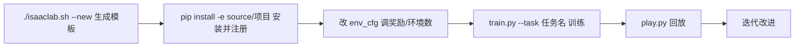

# 第一个训练任务

> 本页属于：train 训练入门
> 前置知识：[[Isaac-Lab项目结构与训练流程]]
> 预计阅读时间：20 分钟

## 这是什么工具？

本页用官方模板生成器 `./isaaclab.sh --new` 创建你自己的环境，注册成 Gymnasium 任务，然后跑一次训练。类比：**从"用别人做好的菜"到"自己开火做一道菜"**——先复制菜谱模板，再改口味，最后上桌。

## 核心概念

| 概念 | 是什么 | 类比 |
|------|--------|------|
| **模板生成器 `--new`** | 交互式生成一个可运行的项目骨架 | 一键生成"新店装修+菜谱模板" |
| **gym.register** | 把环境类注册成一个任务名 | 给菜品上菜单 |
| **entry_point** | 环境类/配置类的 Python 模块路径 | 菜谱在哪个文件哪一行 |
| **editable install (-e)** | 开发模式安装，让你新写的环境能被找到 | 把新菜谱挂到厨房墙上 |

## 快速上手

**第 1 步：生成项目模板**

```bash
cd IsaacLab
./isaaclab.sh --new
```

交互时会问几个问题：

| 问题 | 本页选择 | 含义 |
|------|----------|------|
| External vs Internal | External | 作为独立扩展项目（不写进 Isaac Lab 本体） |
| Direct vs Manager | Direct | 用直接工作流，路径最短 |
| Framework | 勾选 skrl（或 rsl_rl） | 选择要用的训练后端 |

生成后会得到 `source/<你的项目名>/` 目录。

**第 2 步：安装你的项目（可编辑模式）**

```bash
python -m pip install -e source/<你的项目名>
```

> 若你的 conda 环境没在 shell 里激活，可用 `./isaaclab.sh -p -m pip install -e source/<你的项目名>` 代替。

**第 3 步：查看模板里的注册代码**

模板的 `__init__.py` 里会有类似下面的代码：

```python
import gymnasium as gym

gym.register(
    id="Template-isaaclabtutorial_env-v0",   # ① 任务名：train.py --task 就填它
    entry_point=f"{__name__}.isaaclabtutorial_env:IsaaclabtutorialEnv",  # ② 环境类所在模块
    disable_env_checker=True,                # ③ 关闭 Gym 自动检查（Isaac Lab 常用）
    kwargs={
        "env_cfg_entry_point": f"{__name__}.isaaclabtutorial_env_cfg:IsaaclabtutorialEnvCfg",  # ④ 环境配置类
        "skrl_cfg_entry_point": f"{agents.__name__}.skrl_ppo_cfg:PPORunnerCfg",  # ⑤ 训练算法配置
    },
)
```

逐行理解：

- ① `id`：任务的"名字"，全局唯一，训练时靠它找到环境。
- ② `entry_point`：环境类的 Python 路径，`模块:类名`。
- ③ `disable_env_checker`：Isaac Lab 的向量化环境不满足 Gym 的默认检查，所以关闭。
- ④ `env_cfg_entry_point`：环境配置类路径，定义仿真步长、环境数量、奖励权重等。
- ⑤ `skrl_cfg_entry_point`：训练算法（PPO）的超参配置路径。

**第 4 步：看懂配置类（以 Direct 倒立摆为例）**

```python
from isaaclab.envs import DirectRLEnvCfg
from isaaclab.scene import InteractiveSceneCfg
from isaaclab.sim import SimulationCfg
from isaaclab.assets import ArticulationCfg
from isaaclab.utils.configclass import configclass

@configclass
class IsaaclabtutorialEnvCfg(DirectRLEnvCfg):
    decimation = 2                # 每 2 个物理步才做一次决策（省算力）
    episode_length_s = 5.0        # 一个回合最长 5 秒
    action_scale = 100.0          # 动作输出缩放系数
    action_space = 1              # 动作维度（本例 1 个连续力）
    observation_space = 4         # 观测维度（4 个数）
    state_space = 0               # 状态维度（0=不用特权状态）

    sim = SimulationCfg(dt=1/120, render_interval=decimation)  # 物理步长 1/120 秒
    scene = InteractiveSceneCfg(num_envs=4096, env_spacing=4.0, replicate_physics=True)  # 并行环境
    robot_cfg = ArticulationCfg(...)  # 机器人资产配置（USD 路径、关节、执行器）

    # 奖励权重：活着加分、倒下扣分、杆子偏离扣分……
    rew_scale_alive = 1.0
    rew_scale_terminated = -2.0
```

> 这段是 Direct 倒立摆配置的简化版（真实字段更多）。核心思想：**Config 就是一个"参数面板"，`@configclass` 让它能被 Hydra 读取、被命令行覆盖。**

**第 5 步：训练你的任务**

```bash
python scripts/reinforcement_learning/skrl/train.py --task Template-isaaclabtutorial_env-v0 --num_envs 256 --headless
```

**第 6 步：回放看效果**

```bash
python scripts/reinforcement_learning/skrl/play.py --task Template-isaaclabtutorial_env-v0 --num_envs 16
```

## 完整工作流程



## 常见问题 FAQ

**Q1：`--task` 报错 "not registered"？**
确认第 2 步 `pip install -e` 已执行成功；否则 Gymnasium 注册表里没有你的 `id`。

**Q2：Direct 和 Manager 模板怎么选？**
第一次自建任务选 Direct；需要频繁换机器人/传感器/奖励模块时再学 Manager-Based。

**Q3：想改奖励怎么改？**
在 `env_cfg` 里改 `rew_scale_*` 权重，或在环境类的 `_get_rewards()` 里改计算逻辑。

**Q4：训练很慢？**
调小 `--num_envs`、加 `--headless`、减小 `decimation` 相关设置，或换更轻量的任务。

**Q5：训练出的权重在哪？**
`logs/skrl/<task>/<时间戳>/` 下，`play.py` 会自动加载最新权重。

## 速查卡片

```text
生成:   ./isaaclab.sh --new
安装:   python -m pip install -e source/<项目名>
训练:   python scripts/reinforcement_learning/skrl/train.py --task <id> --num_envs 256 --headless
回放:   python scripts/reinforcement_learning/skrl/play.py --task <id> --num_envs 16
注册:   gym.register(id=..., entry_point=..., kwargs={"env_cfg_entry_point":..., "skrl_cfg_entry_point":...})
```

## 本章小结

- `./isaaclab.sh --new` 生成项目骨架，`pip install -e` 安装并注册。
- `gym.register` 决定任务名与类路径；Config 是"参数面板"。
- Direct 工作流：环境类 + 配置类 + 训练配置，三者配合即可训练。
- 跑通本页，你就完成了 train 的"独立完成最小训练任务"目标。

## 下一步

- 上一页：[[Isaac-Lab项目结构与训练流程]]
- 下一页：返回 [[Home]]（build 进阶规划中）
- 返回：[[Home]]

## 更新日志

- 2026-08-31：新增本页。来源：Isaac Lab Quickstart（模板生成器与 gym.register/config 示例）（<https://isaac-sim.github.io/IsaacLab/v2.3.2/source/setup/quickstart.html>，访问于 2026-08-31）。
